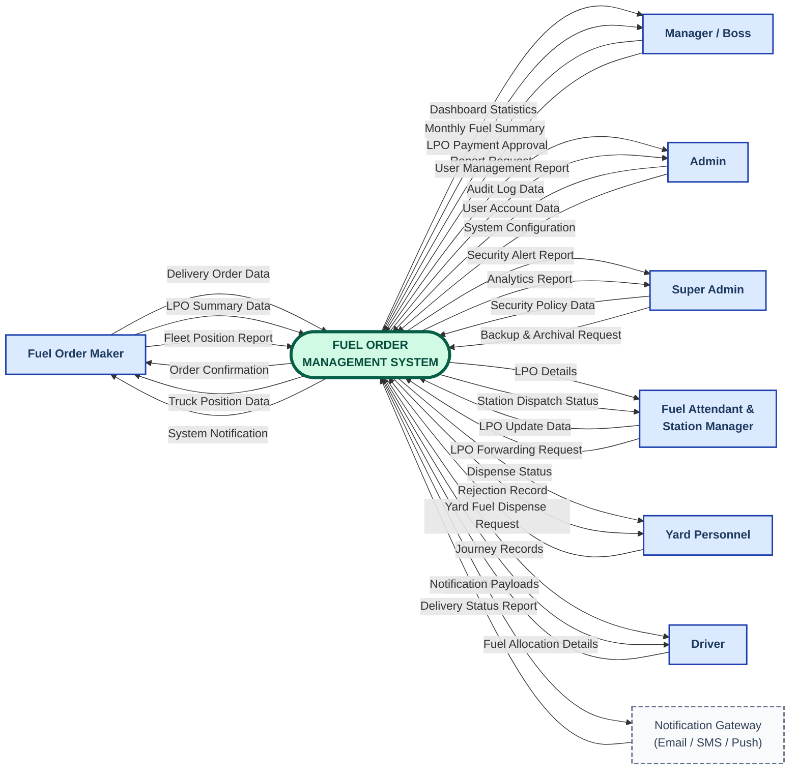

# DATA FLOW DIAGRAM — LEVEL 0 (CONTEXT DIAGRAM)
## Fuel Order Management System (FOMS)

---

### Title Block

| Field | Value |
|---|---|
| **Diagram Type** | Data Flow Diagram — Level 0 (Context Diagram) |
| **System Name** | Fuel Order Management System (FOMS) |
| **Notation** | Yourdon-DeMarco |
| **Diagram Level** | Level 0 — Single central process, all external entities, all major data flows. No data stores. No sub-processes. |
| **Date** | March 30, 2026 |
| **Version** | v1.0 |

---

### Notation Key (Yourdon-DeMarco)

| Symbol | Shape | Meaning |
|---|---|---|
| Rectangle `[ ]` | sharp corners | **External Entity** — person, role, or external system outside the system boundary |
| Stadium / Oval `([ ])` | rounded | **Central Process** — the entire FOMS represented as one bubble |
| Labeled arrow `-->` | directed line | **Data Flow** — movement of named data packets between entity and process |
| *(no data stores)* | — | Data stores are **not shown** at Level 0 — they are internal and appear at Level 1+ |

---

## Level 0 Context Diagram

> **Reading guide:**
> - Every rectangle is an **External Entity** — a person or system that exists outside FOMS.
> - The central stadium node is the **single system process** — the whole FOMS treated as one black box.
> - Every arrow is a **named data flow** (noun phrase) — describing the data packet being exchanged.
> - Arrows pointing **→ into** the central node are **inputs** to the system.
> - Arrows pointing **← out of** the central node are **outputs** from the system.
> - No data stores appear here — they are internal details revealed at Level 1.



---

## External Entity Catalog

All external entities are derived from the `role` enum in
[backend/src/models/User.ts](backend/src/models/User.ts) and the `authorize()` calls
across all route files under [backend/src/routes/](backend/src/routes/).

| ID | Entity | Type | Code Role(s) | Direction |
|---|---|---|---|---|
| E1 | **Fuel Order Maker** | Human — Primary User | `fuel_order_maker` | Source & Sink |
| E2 | **Manager / Boss** | Human — Primary User | `manager`, `super_manager`, `boss` | Source & Sink |
| E4 | **Admin** | Human — Primary User | `admin` | Source & Sink |
| E5 | **Super Admin** | Human — Primary User | `super_admin` | Source & Sink |
| E6 | **Fuel Attendant & Station Manager** | Human — Primary User | `fuel_attendant`, `station_manager` | Source & Sink |
| E6 | **Yard Personnel** | Human — Primary User | `yard_personnel`, `dar_yard`, `tanga_yard`, `mmsa_yard` | Source & Sink |
| E7 | **Driver** | Human — Primary User | `driver` | Source & Sink |
| E8 | **Notification Gateway** | External System | — | Sink (primarily) |

---

## Complete Data Flow Catalog

All flow labels are **noun phrases** (Yourdon-DeMarco rule). Each bidirectional
relationship is represented as **two separate arrows** — no double-headed arrows used.

### Flows from External Entities → FOMS  (Inputs)

| Flow # | Data Flow Label | From Entity | Justification (Code Source) |
|---|---|---|---|
| F-01 | Delivery Order Data | Fuel Order Maker | `POST /delivery-orders` — `deliveryOrderController.ts` |
| F-02 | LPO Summary Data | Fuel Order Maker | `POST /lpo-summaries` — `lpoSummaryController.ts` |
| F-03 | Fleet Position Report | Fuel Order Maker | `POST /fleet-tracking/upload` — `fleetTrackingController.ts` |
| F-04 | LPO Payment Approval | Manager / Boss | `PUT /lpo-entries/:id` — payment approval fields |
| F-07 | Report Request | Manager / Boss | `GET /dashboard/*`, `GET /analytics/*` |
| F-08 | User Account Data | Admin | `POST /users`, `PUT /users/:id` — `userController.ts` |
| F-09 | System Configuration | Admin | `PUT /admin/fuel-stations`, `PUT /system-config/*` |
| F-10 | Security Policy Data | Super Admin | `POST /ip-rules`, `POST /firewall/*`, `POST /threat-detection/*` |
| F-11 | Backup & Archival Request | Super Admin | `POST /backup`, `POST /archival/*` — `backupController.ts` |
| F-12 | LPO Update Data | Fuel Attendant & Station Manager | `PUT /lpo-entries/:id` — attendant/station_manager roles |
| F-13 | LPO Forwarding Request | Fuel Attendant & Station Manager | `POST /lpo-summaries/forward` — `lpoSummaryController.ts` |
| F-14 | Yard Fuel Dispense Request | Yard Personnel | `POST /yard-fuel` — `yardFuelController.ts` |
| F-16 | Driver Credentials | Driver | `POST /auth/login` — `authController.ts` |
| F-17 | Delivery Status Report | Notification Gateway | HTTP callback / queue acknowledgement — `notificationQueue.ts` |

### Flows from FOMS → External Entities  (Outputs)

| Flow # | Data Flow Label | To Entity | Justification (Code Source) |
|---|---|---|---|
| F-18 | Order Confirmation | Fuel Order Maker | Response from `POST /delivery-orders` + notifications |
| F-19 | Truck Position Data | Fuel Order Maker | `GET /fleet-tracking/positions` — `fleetTrackingController.ts` |
| F-20 | System Notification | Fuel Order Maker | Push / email on DO creation, LPO updates |
| F-21 | Dashboard Statistics | Manager / Boss | `GET /dashboard/stats`, `GET /dashboard/chart-data` |
| F-24 | Monthly Fuel Summary | Manager / Boss | `GET /fuel-records/monthly-summary` |
| F-25 | User Management Report | Admin | `GET /users`, `GET /users/export` |
| F-26 | Audit Log Data | Admin | `GET /audit-logs` — `AuditLog` model |
| F-27 | Security Alert Report | Super Admin | `GET /security-alerts`, `GET /security-events` |
| F-28 | Analytics Report | Super Admin | `GET /analytics/revenue`, `GET /analytics/fuel`, export |
| F-29 | LPO Details | Fuel Attendant & Station Manager | `GET /lpo-entries`, `GET /lpo-summaries` |
| F-30 | Station Dispatch Status | Fuel Attendant & Station Manager | Response from `POST /lpo-summaries/forward` |
| F-31 | Dispense Status | Yard Personnel | Response from `POST /yard-fuel` |
| F-34 | Rejection Record | Yard Personnel | `GET /yard-fuel/history/rejections` — `yardFuelController.ts` |
| F-35 | Journey Records | Driver | `GET /delivery-orders/journey/:doNumber` |
| F-36 | Fuel Allocation Details | Driver | `GET /fuel-records/do/:doNumber` |
| F-37 | Notification Payload | Notification Gateway | `emailService.ts`, `smsService.ts`, `pushNotificationService.ts` triggered by system events |

---

## Level 0 DFD Compliance Checklist

Verified against the 12 rules of Level 0 DFD construction:

| Rule | Requirement | Status | Evidence |
|---|---|---|---|
| Rule 1 | Single process only | ✅ | `FOMS` is the only process node in the diagram |
| Rule 2 | No data stores | ✅ | No data store nodes appear; all stores (`DeliveryOrder`, `LPOEntry`, `FuelRecord`, `User`, etc.) are internal — shown at Level 1+ |
| Rule 3 | All data flow arrows labeled | ✅ | All 37 flows carry noun-phrase labels (F-01 through F-37) |
| Rule 4 | No direct entity-to-entity flows | ✅ | Every arrow connects one entity to `FOMS` or `FOMS` to one entity |
| Rule 5 | Every entity has ≥1 data flow | ✅ | All 8 entities have at least one inbound and one outbound flow |
| Rule 6 | No control flows | ✅ | No conditional logic, sequence, or timing shown — only data movement |
| Rule 7 | No process-to-process flows | ✅ | Automatically satisfied — only one process exists at Level 0 |
| Rule 8 | Balanced data flows | ✅ | All F-01 to F-37 flows are available for carry-down to Level 1 without introducing new external flows |
| Rule 9 | No duplicate meaning | ✅ | Each flow label is unique and describes a distinct data packet |
| Rule 10 | Process transforms data | ✅ | FOMS receives raw requests/data and returns processed records, reports, confirmations |
| Rule 11 | Consistent notation | ✅ | Yourdon-DeMarco throughout: rectangles for entities, oval/stadium for process, labeled directed arrows for flows |
| Rule 12 | Readable layout | ✅ | Entities distributed on left and right of central process; no entity-to-entity crossing lines |

---

## Data Flow Summary by Direction

### System Inputs (17 inbound flows)

```
Fuel Order Maker      →  FOMS  :  Delivery Order Data
                      →  FOMS  :  LPO Summary Data
                      →  FOMS  :  Fleet Position Report

Manager / Boss        →  FOMS  :  LPO Payment Approval
                      →  FOMS  :  Report Request

Admin                 →  FOMS  :  User Account Data
                      →  FOMS  :  System Configuration

Super Admin           →  FOMS  :  Security Policy Data
                      →  FOMS  :  Backup & Archival Request

Fuel Attendant        →  FOMS  :  LPO Update Data
& Station Manager     →  FOMS  :  LPO Forwarding Request

Yard Personnel        →  FOMS  :  Yard Fuel Dispense Request

Driver                →  FOMS  :  Driver Credentials

Notification Gateway  →  FOMS  :  Delivery Status Report
```

### System Outputs (20 outbound flows)

```
FOMS  →  Fuel Order Maker      :  Order Confirmation
FOMS  →  Fuel Order Maker      :  Truck Position Data
FOMS  →  Fuel Order Maker      :  System Notification

FOMS  →  Manager / Boss        :  Dashboard Statistics
FOMS  →  Manager / Boss        :  Monthly Fuel Summary

FOMS  →  Admin                 :  User Management Report
FOMS  →  Admin                 :  Audit Log Data

FOMS  →  Super Admin           :  Security Alert Report
FOMS  →  Super Admin           :  Analytics Report

FOMS  →  Fuel Attendant        :  LPO Details
         & Station Manager
FOMS  →  Fuel Attendant        :  Station Dispatch Status
         & Station Manager

FOMS  →  Yard Personnel        :  Dispense Status
FOMS  →  Yard Personnel        :  Rejection Record

FOMS  →  Driver                :  Journey Records
FOMS  →  Driver                :  Fuel Allocation Details

FOMS  →  Notification Gateway  :  Notification Payload
```

---

## Scope & Boundary Notes

**What is INSIDE the FOMS boundary (not shown at Level 0):**
- All internal databases and data stores (shown at Level 1+):
  - DeliveryOrder, LPOEntry, LPOSummary, FuelRecord, YardFuelDispense
  - User, AuditLog, Notification, SystemConfig, FleetSnapshot, Checkpoint
  - SecurityEvent, SecurityAlert, Backup, ArchivedData
- All internal sub-processes (shown at Level 1+):
  - Authentication & Session Management
  - Order Validation & Processing
  - Inventory Tracking
  - Reporting Engine
  - Notification Queue
  - Security Monitoring
  - Backup & Archival Engine
- All internal APIs and middleware (internal to the system)

**What is OUTSIDE the FOMS boundary (shown at Level 0):**
- The 9 human user roles who interact via the web/mobile frontend
- The Notification Gateway (external email/SMS/push delivery infrastructure)
- *(No external Fuel Supplier entity exists in the codebase — supplier management is handled internally through LPO records)*

---

## Diagram Legend

```
┌────────────────────────────────────────────────────────────────┐
│                        LEGEND                                  │
├────────────────────────────────────────────────────────────────┤
│                                                                │
│  ┌──────────────────┐   External Entity (Terminator)          │
│  │   Entity Name    │   Source and/or Sink of data            │
│  └──────────────────┘   EXISTS OUTSIDE the system boundary    │
│                                                                │
│  ╭──────────────────╮   Central Process (Yourdon-DeMarco)     │
│  │  System Process  │   The ENTIRE system as ONE bubble       │
│  ╰──────────────────╯   Only ONE exists at Level 0            │
│                                                                │
│  ──────── Label ──────>  Data Flow Arrow                      │
│                          Noun/noun phrase label required       │
│                          Arrowhead = direction of data flow    │
│                                                                │
│  ╔══╦═════════════╗     Data Store  (NOT shown at Level 0)    │
│  ║D1║  Store Name ║     Internal — appears from Level 1+      │
│  ╚══╩═════════════╝                                           │
│                                                                │
│  NOTE: Two separate arrows (one each way) represent           │
│        bidirectional data exchange. Double-headed arrows       │
│        are NOT used in Yourdon-DeMarco notation.               │
│                                                                │
└────────────────────────────────────────────────────────────────┘
```
