# DATA FLOW DIAGRAM — LEVEL 1
## Fuel Order Management System (FOMS)

---

### Title Block

| Field | Value |
|---|---|
| **Diagram Type** | Data Flow Diagram — Level 1 (First Decomposition) |
| **Parent Diagram** | DFD Level 0 — Context Diagram (`DFD_LEVEL_0.md`) |
| **System Name** | Fuel Order Management System (FOMS) |
| **Notation** | Yourdon-DeMarco |
| **Processes** | 8 major sub-processes (1.0 – 8.0) — within the 3–9 rule |
| **Data Stores** | 7 internal data stores (D1 – D7) |
| **External Entities** | 10 (identical to Level 0 — balanced) |
| **Date** | March 30, 2026 |
| **Version** | v1.0 |

---

### Notation Key (Yourdon-DeMarco)

| Symbol | Mermaid Shape | Meaning |
|---|---|---|
| Rectangle `[ ]` | sharp corners | **External Entity** — outside the system boundary |
| Stadium `([ ])` | rounded pill | **Process** — numbered N.0, VERB + NOUN label, transforms data |
| Cylinder `[( )]` | database shape | **Data Store** — DN-prefixed, noun label, persists data inside the system |
| Labeled arrow `-->` | directed line | **Data Flow** — noun-phrase label, direction = data movement |

---

### What Is New at Level 1 vs Level 0

| Element | Level 0 | Level 1 |
|---|---|---|
| Processes | 1 (entire system) | 8 major sub-processes |
| Data Stores | None (internal — hidden) | 7 data stores introduced for the first time |
| External Entities | 10 | 10 (**same — no new entities added**) |
| External Data Flows | 37 | 37 (**same — fully balanced**) |
| Internal Flows | None | Process↔Store and cross-process data flows added |

---

## Level 1 DFD — View A: System Boundary & Process Flows

> **View A** shows all 8 processes inside the system boundary, all 10 external entities, and all 37 external data flows (the complete set carried down from Level 0). Data stores are omitted here for readability — see View B for those.

```mermaid
flowchart LR

    %%═══════════════════════════════════════════════════════
    %% EXTERNAL ENTITIES  (Yourdon-DeMarco: Rectangles)
    %% All 10 entities identical to Level 0 — DFD balance rule
    %%═══════════════════════════════════════════════════════
    FOM["Fuel Order Maker"]
    CLK["Clerk / Supervisor"]
    MGR["Manager / Boss"]
    ATT["Fuel Attendant &\nStation Manager"]
    PMG["Payment Manager"]
    YRD["Yard Personnel"]
    DRV["Driver"]
    ADM["Admin"]
    SAM["Super Admin"]
    NGW["Notification Gateway\n(Email / SMS / Push)"]

    %%═══════════════════════════════════════════════════════
    %% SYSTEM BOUNDARY — contains all processes
    %%═══════════════════════════════════════════════════════
    subgraph SYS["  FUEL ORDER MANAGEMENT SYSTEM  "]
        direction TB

        P1(["1.0\nAuthenticate &\nManage Users"])
        P2(["2.0\nProcess\nDelivery Orders"])
        P3(["3.0\nManage\nLPO Records"])
        P4(["4.0\nRecord\nFuel Dispensing"])
        P5(["5.0\nTrack Fleet\n& Checkpoints"])
        P6(["6.0\nGenerate Reports\n& Analytics"])
        P7(["7.0\nAdminister System\n& Security"])
        P8(["8.0\nDispatch\nNotifications"])
    end

    %%═══════════════════════════════════════════════════════
    %% EXTERNAL → PROCESS  (INPUT flows — all from Level 0)
    %% Each corresponds to F-01 through F-17 in DFD Level 0
    %%═══════════════════════════════════════════════════════

    %% ── Fuel Order Maker ──────────────────────────────────
    FOM -->|"Delivery Order Data"| P2
    FOM -->|"LPO Summary Data"| P3
    FOM -->|"Fleet Position Report"| P5

    %% ── Clerk / Supervisor ────────────────────────────────
    CLK -->|"LPO Entry Data"| P3
    CLK -->|"Fuel Dispensing Record"| P4

    %% ── Manager / Boss ────────────────────────────────────
    MGR -->|"LPO Payment Approval"| P3
    MGR -->|"Report Request"| P6

    %% ── Fuel Attendant & Station Manager ──────────────────
    ATT -->|"LPO Update Data"| P3
    ATT -->|"LPO Forwarding Request"| P3

    %% ── Payment Manager ───────────────────────────────────
    PMG -->|"Payment Approval Data"| P3

    %% ── Yard Personnel ────────────────────────────────────
    YRD -->|"Yard Fuel Dispense Request"| P4

    %% ── Driver ────────────────────────────────────────────
    DRV -->|"Driver Credentials"| P1

    %% ── Admin ─────────────────────────────────────────────
    ADM -->|"User Account Data"| P1
    ADM -->|"System Configuration"| P7

    %% ── Super Admin ───────────────────────────────────────
    SAM -->|"Security Policy Data"| P7
    SAM -->|"Backup & Archival Request"| P7

    %% ── Notification Gateway ──────────────────────────────
    NGW -->|"Delivery Status Report"| P8

    %%═══════════════════════════════════════════════════════
    %% PROCESS → EXTERNAL  (OUTPUT flows — all from Level 0)
    %% Each corresponds to F-18 through F-37 in DFD Level 0
    %%═══════════════════════════════════════════════════════

    %% ── To Fuel Order Maker ───────────────────────────────
    P2 -->|"Order Confirmation"| FOM
    P5 -->|"Truck Position Data"| FOM
    P8 -->|"System Notification"| FOM

    %% ── To Clerk / Supervisor ─────────────────────────────
    P3 -->|"LPO Entry Confirmation"| CLK
    P4 -->|"Fuel Record Status"| CLK

    %% ── To Manager / Boss ─────────────────────────────────
    P6 -->|"Dashboard Statistics"| MGR
    P6 -->|"Monthly Fuel Summary"| MGR

    %% ── To Fuel Attendant & Station Manager ───────────────
    P3 -->|"LPO Details"| ATT
    P3 -->|"Station Dispatch Status"| ATT

    %% ── To Payment Manager ────────────────────────────────
    P3 -->|"LPO Invoice Details"| PMG
    P3 -->|"Payment Confirmation"| PMG

    %% ── To Yard Personnel ─────────────────────────────────
    P4 -->|"Dispense Status"| YRD
    P4 -->|"Rejection Record"| YRD

    %% ── To Driver ─────────────────────────────────────────
    P2 -->|"Journey Records"| DRV
    P2 -->|"Fuel Allocation Details"| DRV

    %% ── To Admin ──────────────────────────────────────────
    P1 -->|"User Management Report"| ADM
    P6 -->|"Audit Log Data"| ADM

    %% ── To Super Admin ────────────────────────────────────
    P7 -->|"Security Alert Report"| SAM
    P6 -->|"Analytics Report"| SAM

    %% ── To Notification Gateway ───────────────────────────
    P8 -->|"Notification Payload"| NGW

    %%═══════════════════════════════════════════════════════
    %% STYLING
    %%═══════════════════════════════════════════════════════
    classDef entity   fill:#dbeafe,stroke:#1e40af,stroke-width:2px,color:#1e3a5f,font-weight:bold
    classDef extSys   fill:#f1f5f9,stroke:#64748b,stroke-width:2px,stroke-dasharray:5 3,color:#334155
    classDef process  fill:#dcfce7,stroke:#15803d,stroke-width:2px,color:#14532d,font-weight:bold

    class FOM,CLK,MGR,ATT,PMG,YRD,DRV,ADM,SAM entity
    class NGW extSys
    class P1,P2,P3,P4,P5,P6,P7,P8 process
```



---

## Level 1 DFD — View B: Internal Process & Data Store Flows

> **View B** shows all 8 processes, all 7 internal data stores (first introduced at Level 1), and the key data flows between them. External entities are omitted here for readability — see View A for those. Together, View A and View B constitute the complete Level 1 DFD.
>
> **DFD Rule reminder:** Arrows **into** a store = writing/saving data. Arrows **out of** a store = reading/retrieving data. No data store is connected directly to another data store or to an external entity — all data passes through a process first.

```mermaid
flowchart TB

    %%═══════════════════════════════════════════════════════
    %% SYSTEM BOUNDARY — processes + data stores
    %%═══════════════════════════════════════════════════════
    subgraph SYS["  FUEL ORDER MANAGEMENT SYSTEM — Internal Flows  "]
        direction LR

        %%─────────────────────────────────────────
        %% PROCESSES (Yourdon-DeMarco: Ovals/Stadiums)
        %%─────────────────────────────────────────
        P1(["1.0\nAuthenticate &\nManage Users"])
        P2(["2.0\nProcess\nDelivery Orders"])
        P3(["3.0\nManage\nLPO Records"])
        P4(["4.0\nRecord\nFuel Dispensing"])
        P5(["5.0\nTrack Fleet\n& Checkpoints"])
        P6(["6.0\nGenerate Reports\n& Analytics"])
        P7(["7.0\nAdminister System\n& Security"])
        P8(["8.0\nDispatch\nNotifications"])

        %%─────────────────────────────────────────
        %% DATA STORES (Yourdon-DeMarco: Open rectangles)
        %% Approximated as database cylinders in Mermaid
        %%─────────────────────────────────────────
        D1[("D1\nUser Records")]
        D2[("D2\nDelivery Orders")]
        D3[("D3\nLPO Records")]
        D4[("D4\nFuel Records")]
        D5[("D5\nFleet &\nCheckpoint Data")]
        D6[("D6\nNotification &\nAudit Logs")]
        D7[("D7\nSystem\nConfiguration")]

        %%─────────────────────────────────────────────────
        %% PROCESS 1.0 ↔ D1 (User Records)
        %% auth.ts middleware reads D1 on every authenticated request
        %% userController.ts writes D1 on create/update/delete
        %%─────────────────────────────────────────────────
        P1 -->|"User Account Record"| D1
        D1 -->|"Validated Credentials"| P1

        %%─────────────────────────────────────────────────
        %% PROCESS 1.0 → D6 (Activity logging on auth events)
        %%─────────────────────────────────────────────────
        P1 -->|"User Activity Log"| D6

        %%─────────────────────────────────────────────────
        %% PROCESS 1.0 reads D7 for password policy config
        %% systemConfigRoutes → authController uses policy
        %%─────────────────────────────────────────────────
        D7 -->|"Password Policy"| P1

        %%─────────────────────────────────────────────────
        %% PROCESS 2.0 ↔ D2 (Delivery Orders)
        %% deliveryOrderController.ts — create, update, read
        %%─────────────────────────────────────────────────
        P2 -->|"Delivery Order Record"| D2
        D2 -->|"Delivery Order Details"| P2

        %%─────────────────────────────────────────────────
        %% PROCESS 2.0 → D6 (Order events for notifications)
        %%─────────────────────────────────────────────────
        P2 -->|"Order Activity Log"| D6

        %%─────────────────────────────────────────────────
        %% PROCESS 3.0 ↔ D3 (LPO Records)
        %% lpoEntryController, lpoSummaryController
        %%─────────────────────────────────────────────────
        P3 -->|"LPO Entry Record"| D3
        P3 -->|"LPO Summary Record"| D3
        D3 -->|"LPO Data"| P3

        %%─────────────────────────────────────────────────
        %% PROCESS 3.0 reads D2 for DO cross-reference
        %% (LPO summary links to specific delivery order)
        %%─────────────────────────────────────────────────
        D2 -->|"DO Reference Data"| P3

        %%─────────────────────────────────────────────────
        %% PROCESS 3.0 → D6 (LPO payment events trigger notifications)
        %%─────────────────────────────────────────────────
        P3 -->|"LPO Notification Request"| D6

        %%─────────────────────────────────────────────────
        %% PROCESS 4.0 ↔ D4 (Fuel Records)
        %% fuelRecordController, yardFuelController
        %%─────────────────────────────────────────────────
        P4 -->|"Fuel Dispense Record"| D4
        D4 -->|"Dispense History"| P4

        %%─────────────────────────────────────────────────
        %% PROCESS 4.0 reads D3 for LPO validation
        %% (fuel record must reference a valid LPO entry)
        %%─────────────────────────────────────────────────
        D3 -->|"LPO Validation Reference"| P4

        %%─────────────────────────────────────────────────
        %% PROCESS 4.0 → D6 (Yard rejection events → notifications)
        %%─────────────────────────────────────────────────
        P4 -->|"Dispense Activity Log"| D6

        %%─────────────────────────────────────────────────
        %% PROCESS 5.0 ↔ D5 (Fleet & Checkpoint Data)
        %% fleetTrackingController, checkpointController
        %%─────────────────────────────────────────────────
        P5 -->|"Fleet Snapshot"| D5
        D5 -->|"Historical Position Data"| P5

        %%─────────────────────────────────────────────────
        %% PROCESS 5.0 reads D2 for journey correlation
        %% (truck positions tied to active delivery orders)
        %%─────────────────────────────────────────────────
        D2 -->|"Active Journey Reference"| P5

        %%─────────────────────────────────────────────────
        %% PROCESS 6.0 reads from ALL data stores for reports
        %% analyticsController, dashboardController
        %% P6 is READ-ONLY — it transforms data into reports
        %%─────────────────────────────────────────────────
        D2 -->|"Order Records"| P6
        D3 -->|"LPO Records"| P6
        D4 -->|"Fuel Records"| P6
        D5 -->|"Fleet Data"| P6
        D6 -->|"Audit Records"| P6

        %%─────────────────────────────────────────────────
        %% PROCESS 7.0 ↔ D7 (System Configuration)
        %% systemConfigController, adminController,
        %% ipRuleController, firewallController, backupController
        %%─────────────────────────────────────────────────
        P7 -->|"Configuration Record"| D7
        D7 -->|"Configuration Data"| P7

        %%─────────────────────────────────────────────────
        %% PROCESS 7.0 → D6 (Security events feed audit log)
        %%─────────────────────────────────────────────────
        P7 -->|"Security Event Log"| D6

        %%─────────────────────────────────────────────────
        %% PROCESS 8.0 ↔ D6 (Notification queue pattern)
        %% notificationQueue.ts reads pending notification
        %% requests; writes back delivery status
        %%─────────────────────────────────────────────────
        D6 -->|"Notification Request"| P8
        P8 -->|"Notification Delivery Status"| D6

    end

    %%═══════════════════════════════════════════════════════
    %% STYLING
    %%═══════════════════════════════════════════════════════
    classDef process  fill:#dcfce7,stroke:#15803d,stroke-width:2px,color:#14532d,font-weight:bold
    classDef store    fill:#fef9c3,stroke:#b45309,stroke-width:2px,color:#713f12,font-weight:bold

    class P1,P2,P3,P4,P5,P6,P7,P8 process
    class D1,D2,D3,D4,D5,D6,D7 store
```



---

## Process Descriptions

### 1.0 — Authenticate & Manage Users

| Property | Detail |
|---|---|
| **Number** | 1.0 |
| **Name** | Authenticate & Manage Users |
| **Code Source** | `authController.ts`, `userController.ts`, `mfaController.ts`, `sessionController.ts`, `auth.ts` middleware |
| **Function** | Validates login credentials, manages JWT sessions, enforces MFA, handles password changes (first login, forgot password, admin reset), and performs full CRUD on user accounts |
| **External Inputs** | Driver Credentials (from Driver); User Account Data (from Admin) |
| **External Outputs** | User Management Report (to Admin) |
| **Reads from** | D1 User Records (credential validation, profile lookup); D7 System Configuration (password policy, session config) |
| **Writes to** | D1 User Records (create / update / deactivate user); D6 Notification & Audit Logs (login/logout/change events) |
| **Decompose?** | Yes — Level 2 processes: 1.1 Validate Login Credentials, 1.2 Manage MFA, 1.3 Manage User Accounts, 1.4 Reset Password |

---

### 2.0 — Process Delivery Orders

| Property | Detail |
|---|---|
| **Number** | 2.0 |
| **Name** | Process Delivery Orders |
| **Code Source** | `deliveryOrderController.ts`, `deliveryOrderRoutes.ts` |
| **Function** | Creates and manages Delivery Orders (DOs) and Supplementary Delivery Orders (SDOs), generates workbooks (by year/month), produces PDFs, tracks truck journeys through checkpoints, and correlates fuel allocations per DO |
| **External Inputs** | Delivery Order Data (from Fuel Order Maker) |
| **External Outputs** | Order Confirmation (to Fuel Order Maker); Journey Records (to Driver); Fuel Allocation Details (to Driver) |
| **Reads from** | D2 Delivery Orders (view, search, workbook generation, journey tracking) |
| **Writes to** | D2 Delivery Orders (create / update DO record); D6 Notification & Audit Logs (order creation events) |
| **Decompose?** | Yes — Level 2 processes: 2.1 Create Delivery Order, 2.2 Manage SDO, 2.3 Track Truck Journey, 2.4 Export Workbook / PDF |

---

### 3.0 — Manage LPO Records

| Property | Detail |
|---|---|
| **Number** | 3.0 |
| **Name** | Manage LPO Records |
| **Code Source** | `lpoEntryController.ts`, `lpoSummaryController.ts`, `lpoEntryRoutes.ts`, `lpoSummaryRoutes.ts` |
| **Function** | Manages the full LPO lifecycle: creates LPO Entries (per-station fuel purchase orders) and LPO Summaries (truck allocation workbooks), handles forwarding LPOs to other stations, cancels trucks from allocations, processes payment approvals, and generates workbook exports |
| **External Inputs** | LPO Summary Data (from Fuel Order Maker); LPO Entry Data (from Clerk/Supervisor); LPO Payment Approval (from Manager/Boss); LPO Update Data (from Attendant/Station Manager); LPO Forwarding Request (from Attendant/Station Manager); Payment Approval Data (from Payment Manager) |
| **External Outputs** | LPO Entry Confirmation (to Clerk); LPO Details (to Attendant/Station Manager); Station Dispatch Status (to Attendant/Station Manager); LPO Invoice Details (to Payment Manager); Payment Confirmation (to Payment Manager) |
| **Reads from** | D3 LPO Records; D2 Delivery Orders (DO cross-reference) |
| **Writes to** | D3 LPO Records (create / update entry and summary); D6 Notification & Audit Logs (payment approval events) |
| **Decompose?** | Yes — Level 2 processes: 3.1 Create LPO Entry, 3.2 Create LPO Summary, 3.3 Forward LPO, 3.4 Approve LPO Payment, 3.5 Export LPO Workbook |

---

### 4.0 — Record Fuel Dispensing

| Property | Detail |
|---|---|
| **Number** | 4.0 |
| **Name** | Record Fuel Dispensing |
| **Code Source** | `fuelRecordController.ts`, `yardFuelController.ts`, `fuelRecordRoutes.ts`, `yardFuelRoutes.ts` |
| **Function** | Records fuel dispensed at external fuel stations (tied to LPO entries) and at internal company yards (yard fuel dispense with reject/approve workflow). Maintains dispense history, provides rejection tracking for yard personnel, and computes monthly summaries |
| **External Inputs** | Fuel Dispensing Record (from Clerk/Supervisor); Yard Fuel Dispense Request (from Yard Personnel) |
| **External Outputs** | Fuel Record Status (to Clerk/Supervisor); Dispense Status (to Yard Personnel); Rejection Record (to Yard Personnel) |
| **Reads from** | D4 Fuel Records (history, monthly summary); D3 LPO Records (LPO reference validation for station fuel records) |
| **Writes to** | D4 Fuel Records (station fuel record and yard fuel dispense); D6 Notification & Audit Logs (rejection events) |
| **Decompose?** | Yes — Level 2 processes: 4.1 Record Station Fuel, 4.2 Dispense Yard Fuel, 4.3 Reject Yard Fuel Request, 4.4 Generate Monthly Fuel Summary |

---

### 5.0 — Track Fleet & Checkpoints

| Property | Detail |
|---|---|
| **Number** | 5.0 |
| **Name** | Track Fleet & Checkpoints |
| **Code Source** | `fleetTrackingController.ts`, `checkpointController.ts`, `fleetTrackingRoutes.ts`, `checkpointRoutes.ts` |
| **Function** | Ingests uploaded fleet position reports (Excel/CSV), stores them as fleet snapshots, provides real-time truck-to-checkpoint position views, computes checkpoint distribution statistics, and allows copying of truck lists per checkpoint. Also manages the checkpoint configuration (create, reorder, seed) |
| **External Inputs** | Fleet Position Report (from Fuel Order Maker) |
| **External Outputs** | Truck Position Data (to Fuel Order Maker) |
| **Reads from** | D5 Fleet & Checkpoint Data (historical positions, checkpoint config); D2 Delivery Orders (active journey reference for position correlation) |
| **Writes to** | D5 Fleet & Checkpoint Data (new fleet snapshot, checkpoint records) |
| **Decompose?** | Yes — Level 2 processes: 5.1 Upload Fleet Report, 5.2 View Truck Positions, 5.3 Manage Checkpoints |

---

### 6.0 — Generate Reports & Analytics

| Property | Detail |
|---|---|
| **Number** | 6.0 |
| **Name** | Generate Reports & Analytics |
| **Code Source** | `analyticsController.ts`, `dashboardController.ts`, `customReportController.ts`, `analyticsRoutes.ts`, `dashboardRoutes.ts` |
| **Function** | Aggregates data from all operational stores to produce dashboard statistics, monthly fuel summaries, revenue reports, fuel consumption reports, user activity reports, system performance metrics, and custom reports. Also surfaces audit log data for admin review. All data flows to this process are reads; it does not write to any data store |
| **External Inputs** | Report Request (from Manager/Boss) |
| **External Outputs** | Dashboard Statistics (to Manager/Boss); Monthly Fuel Summary (to Manager/Boss); Audit Log Data (to Admin); Analytics Report (to Super Admin) |
| **Reads from** | D2 Delivery Orders; D3 LPO Records; D4 Fuel Records; D5 Fleet & Checkpoint Data; D6 Notification & Audit Logs |
| **Writes to** | *(none — read-only process)* |
| **Decompose?** | Yes — Level 2 processes: 6.1 Generate Dashboard Statistics, 6.2 Generate Analytics Report, 6.3 View Audit Log, 6.4 Generate Custom Report |

---

### 7.0 — Administer System & Security

| Property | Detail |
|---|---|
| **Number** | 7.0 |
| **Name** | Administer System & Security |
| **Code Source** | `adminController.ts`, `systemConfigController.ts`, `backupController.ts`, `archivalController.ts`, `ipRuleController.ts`, `firewallController.ts`, `threatDetectionController.ts`, `siemController.ts`, `securityAlertController.ts`, `securityEventsController.ts`, `fuelPriceController.ts` |
| **Function** | Manages all system-level configuration: fuel stations and their pricing, route definitions, system settings, backup creation and scheduling, data archival and restoration, IP allow/block rules, firewall path rules, threat detection configuration, SIEM integration, and security alert generation. Generates security alert reports for Super Admin review |
| **External Inputs** | System Configuration (from Admin); Security Policy Data (from Super Admin); Backup & Archival Request (from Super Admin) |
| **External Outputs** | Security Alert Report (to Super Admin) |
| **Reads from** | D7 System Configuration (current config, backup records, security rules); D6 Notification & Audit Logs (security event history for alert generation) |
| **Writes to** | D7 System Configuration (updated config, new backup records, security rules); D6 Notification & Audit Logs (new security events) |
| **Decompose?** | Yes — Level 2 processes: 7.1 Configure System Settings, 7.2 Manage Fuel Stations & Prices, 7.3 Manage Backup & Archival, 7.4 Manage Security Rules, 7.5 Monitor Security Events |

---

### 8.0 — Dispatch Notifications

| Property | Detail |
|---|---|
| **Number** | 8.0 |
| **Name** | Dispatch Notifications |
| **Code Source** | `notificationController.ts`, `notificationQueue.ts`, `emailService.ts`, `smsService.ts`, `pushNotificationService.ts`, `slackNotificationService.ts`, `notificationRoutes.ts` |
| **Function** | Reads pending notification requests written to D6 by other processes (order creation, LPO payment approval, yard fuel rejection, security events) and dispatches them through the appropriate channel — email, SMS, browser push, mobile push, or Slack. Records delivery status back to D6. Handles push subscription management (browser and mobile) |
| **External Inputs** | Delivery Status Report (from Notification Gateway — acknowledgement/callback) |
| **External Outputs** | System Notification (to Fuel Order Maker); Notification Payload (to Notification Gateway) |
| **Reads from** | D6 Notification & Audit Logs (pending notification requests) |
| **Writes to** | D6 Notification & Audit Logs (notification delivery status) |
| **Decompose?** | Yes — Level 2 processes: 8.1 Read Notification Queue, 8.2 Dispatch Email / SMS, 8.3 Dispatch Push Notification, 8.4 Record Delivery Status |

---

## Data Store Catalog

All data stores are **first introduced at Level 1** (they do not appear at Level 0). Every store has at least one write flow and at least one read flow — no "dead stores" or "miraculous stores".

| ID | Store Name | Code Source (Models) | Primary Writers | Primary Readers |
|---|---|---|---|---|
| **D1** | User Records | `User.ts` | P1 (Authenticate & Manage Users) | P1 |
| **D2** | Delivery Orders | `DeliveryOrder.ts` | P2 (Process Delivery Orders) | P2, P3, P5, P6 |
| **D3** | LPO Records | `LPOEntry.ts`, `LPOSummary.ts`, `LPOWorkbook.ts` | P3 (Manage LPO Records) | P3, P4, P6 |
| **D4** | Fuel Records | `FuelRecord.ts`, `YardFuelDispense.ts` | P4 (Record Fuel Dispensing) | P4, P6 |
| **D5** | Fleet & Checkpoint Data | `FleetSnapshot.ts`, `TruckPosition.ts`, `Checkpoint.ts` | P5 (Track Fleet & Checkpoints) | P5, P6 |
| **D6** | Notification & Audit Logs | `AuditLog.ts`, `Notification.ts`, `LoginActivity.ts`, `SecurityEvent.ts` | P1, P2, P3, P4, P7, P8 | P6, P7, P8 |
| **D7** | System Configuration | `SystemConfig.ts`, `FuelStationConfig.ts`, `FuelPrice.ts`, `RouteConfig.ts`, `Backup.ts`, `BackupSchedule.ts`, `IPRule.ts`, `FirewallConfig.ts` | P7 (Administer System & Security) | P7, P1 |

---

## Complete Flow Inventory

### External Boundary Flows (Balanced with Level 0)

All 37 flows from `DFD_LEVEL_0.md` are accounted for exactly — no new external flows, none removed.

| Flow | Label (Noun Phrase) | Source | Destination | Process at L1 |
|---|---|---|---|---|
| F-01 | Delivery Order Data | Fuel Order Maker | FOMS | P2 |
| F-02 | LPO Summary Data | Fuel Order Maker | FOMS | P3 |
| F-03 | Fleet Position Report | Fuel Order Maker | FOMS | P5 |
| F-04 | LPO Entry Data | Clerk / Supervisor | FOMS | P3 |
| F-05 | Fuel Dispensing Record | Clerk / Supervisor | FOMS | P4 |
| F-06 | LPO Payment Approval | Manager / Boss | FOMS | P3 |
| F-07 | Report Request | Manager / Boss | FOMS | P6 |
| F-08 | User Account Data | Admin | FOMS | P1 |
| F-09 | System Configuration | Admin | FOMS | P7 |
| F-10 | Security Policy Data | Super Admin | FOMS | P7 |
| F-11 | Backup & Archival Request | Super Admin | FOMS | P7 |
| F-12 | LPO Update Data | Fuel Attendant & Station Manager | FOMS | P3 |
| F-13 | LPO Forwarding Request | Fuel Attendant & Station Manager | FOMS | P3 |
| F-14 | Payment Approval Data | Payment Manager | FOMS | P3 |
| F-15 | Yard Fuel Dispense Request | Yard Personnel | FOMS | P4 |
| F-16 | Driver Credentials | Driver | FOMS | P1 |
| F-17 | Delivery Status Report | Notification Gateway | FOMS | P8 |
| F-18 | Order Confirmation | FOMS | Fuel Order Maker | P2 |
| F-19 | Truck Position Data | FOMS | Fuel Order Maker | P5 |
| F-20 | System Notification | FOMS | Fuel Order Maker | P8 |
| F-21 | LPO Entry Confirmation | FOMS | Clerk / Supervisor | P3 |
| F-22 | Fuel Record Status | FOMS | Clerk / Supervisor | P4 |
| F-23 | Dashboard Statistics | FOMS | Manager / Boss | P6 |
| F-24 | Monthly Fuel Summary | FOMS | Manager / Boss | P6 |
| F-25 | User Management Report | FOMS | Admin | P1 |
| F-26 | Audit Log Data | FOMS | Admin | P6 |
| F-27 | Security Alert Report | FOMS | Super Admin | P7 |
| F-28 | Analytics Report | FOMS | Super Admin | P6 |
| F-29 | LPO Details | FOMS | Fuel Attendant & Station Manager | P3 |
| F-30 | Station Dispatch Status | FOMS | Fuel Attendant & Station Manager | P3 |
| F-31 | LPO Invoice Details | FOMS | Payment Manager | P3 |
| F-32 | Payment Confirmation | FOMS | Payment Manager | P3 |
| F-33 | Dispense Status | FOMS | Yard Personnel | P4 |
| F-34 | Rejection Record | FOMS | Yard Personnel | P4 |
| F-35 | Journey Records | FOMS | Driver | P2 |
| F-36 | Fuel Allocation Details | FOMS | Driver | P2 |
| F-37 | Notification Payload | FOMS | Notification Gateway | P8 |

### Internal Flows (Process ↔ Data Store)

| Flow | Label (Noun Phrase) | From | To | Type |
|---|---|---|---|---|
| I-01 | User Account Record | P1 | D1 | Write |
| I-02 | Validated Credentials | D1 | P1 | Read |
| I-03 | Password Policy | D7 | P1 | Read |
| I-04 | User Activity Log | P1 | D6 | Write |
| I-05 | Delivery Order Record | P2 | D2 | Write |
| I-06 | Delivery Order Details | D2 | P2 | Read |
| I-07 | Order Activity Log | P2 | D6 | Write |
| I-08 | LPO Entry Record | P3 | D3 | Write |
| I-09 | LPO Summary Record | P3 | D3 | Write |
| I-10 | LPO Data | D3 | P3 | Read |
| I-11 | DO Reference Data | D2 | P3 | Read |
| I-12 | LPO Notification Request | P3 | D6 | Write |
| I-13 | Fuel Dispense Record | P4 | D4 | Write |
| I-14 | Dispense History | D4 | P4 | Read |
| I-15 | LPO Validation Reference | D3 | P4 | Read |
| I-16 | Dispense Activity Log | P4 | D6 | Write |
| I-17 | Fleet Snapshot | P5 | D5 | Write |
| I-18 | Historical Position Data | D5 | P5 | Read |
| I-19 | Active Journey Reference | D2 | P5 | Read |
| I-20 | Order Records | D2 | P6 | Read |
| I-21 | LPO Records | D3 | P6 | Read |
| I-22 | Fuel Records | D4 | P6 | Read |
| I-23 | Fleet Data | D5 | P6 | Read |
| I-24 | Audit Records | D6 | P6 | Read |
| I-25 | Configuration Record | P7 | D7 | Write |
| I-26 | Configuration Data | D7 | P7 | Read |
| I-27 | Security Event Log | P7 | D6 | Write |
| I-28 | Notification Request | D6 | P8 | Read |
| I-29 | Notification Delivery Status | P8 | D6 | Write |

**Total: 37 external flows + 29 internal flows = 66 data flows at Level 1**

---

## Level 0 → Level 1 Balance Verification

This is the critical DFD balancing check. Every external data flow from `DFD_LEVEL_0.md` must appear at Level 1 as a flow between an external entity and a Level 1 process.

| L0 Flow | Label | L0: Flows to/from... | L1: Handled by... | Status |
|---|---|---|---|---|
| F-01 | Delivery Order Data | Fuel Order Maker → FOMS | Fuel Order Maker → **P2** | ✅ |
| F-02 | LPO Summary Data | Fuel Order Maker → FOMS | Fuel Order Maker → **P3** | ✅ |
| F-03 | Fleet Position Report | Fuel Order Maker → FOMS | Fuel Order Maker → **P5** | ✅ |
| F-04 | LPO Entry Data | Clerk → FOMS | Clerk → **P3** | ✅ |
| F-05 | Fuel Dispensing Record | Clerk → FOMS | Clerk → **P4** | ✅ |
| F-06 | LPO Payment Approval | Manager → FOMS | Manager → **P3** | ✅ |
| F-07 | Report Request | Manager → FOMS | Manager → **P6** | ✅ |
| F-08 | User Account Data | Admin → FOMS | Admin → **P1** | ✅ |
| F-09 | System Configuration | Admin → FOMS | Admin → **P7** | ✅ |
| F-10 | Security Policy Data | Super Admin → FOMS | Super Admin → **P7** | ✅ |
| F-11 | Backup & Archival Request | Super Admin → FOMS | Super Admin → **P7** | ✅ |
| F-12 | LPO Update Data | Attendant → FOMS | Attendant → **P3** | ✅ |
| F-13 | LPO Forwarding Request | Attendant → FOMS | Attendant → **P3** | ✅ |
| F-14 | Payment Approval Data | Payment Manager → FOMS | Payment Manager → **P3** | ✅ |
| F-15 | Yard Fuel Dispense Request | Yard Personnel → FOMS | Yard Personnel → **P4** | ✅ |
| F-16 | Driver Credentials | Driver → FOMS | Driver → **P1** | ✅ |
| F-17 | Delivery Status Report | NGW → FOMS | NGW → **P8** | ✅ |
| F-18 | Order Confirmation | FOMS → Fuel Order Maker | **P2** → Fuel Order Maker | ✅ |
| F-19 | Truck Position Data | FOMS → Fuel Order Maker | **P5** → Fuel Order Maker | ✅ |
| F-20 | System Notification | FOMS → Fuel Order Maker | **P8** → Fuel Order Maker | ✅ |
| F-21 | LPO Entry Confirmation | FOMS → Clerk | **P3** → Clerk | ✅ |
| F-22 | Fuel Record Status | FOMS → Clerk | **P4** → Clerk | ✅ |
| F-23 | Dashboard Statistics | FOMS → Manager | **P6** → Manager | ✅ |
| F-24 | Monthly Fuel Summary | FOMS → Manager | **P6** → Manager | ✅ |
| F-25 | User Management Report | FOMS → Admin | **P1** → Admin | ✅ |
| F-26 | Audit Log Data | FOMS → Admin | **P6** → Admin | ✅ |
| F-27 | Security Alert Report | FOMS → Super Admin | **P7** → Super Admin | ✅ |
| F-28 | Analytics Report | FOMS → Super Admin | **P6** → Super Admin | ✅ |
| F-29 | LPO Details | FOMS → Attendant | **P3** → Attendant | ✅ |
| F-30 | Station Dispatch Status | FOMS → Attendant | **P3** → Attendant | ✅ |
| F-31 | LPO Invoice Details | FOMS → Payment Manager | **P3** → Payment Manager | ✅ |
| F-32 | Payment Confirmation | FOMS → Payment Manager | **P3** → Payment Manager | ✅ |
| F-33 | Dispense Status | FOMS → Yard Personnel | **P4** → Yard Personnel | ✅ |
| F-34 | Rejection Record | FOMS → Yard Personnel | **P4** → Yard Personnel | ✅ |
| F-35 | Journey Records | FOMS → Driver | **P2** → Driver | ✅ |
| F-36 | Fuel Allocation Details | FOMS → Driver | **P2** → Driver | ✅ |
| F-37 | Notification Payload | FOMS → NGW | **P8** → NGW | ✅ |

**All 37 Level 0 flows are present at Level 1. Diagram is BALANCED. ✅**

---

## Level 1 Compliance Checklist

Verified against the 15 rules of Level 1 DFD construction:

| Rule | Requirement | Status | Evidence |
|---|---|---|---|
| Rule 1 | Balanced with Level 0 | ✅ | All 37 external flows accounted for — see balance table above |
| Rule 2 | 3–9 processes | ✅ | 8 processes (1.0–8.0) — within limit |
| Rule 3 | Every process has ≥1 input AND ≥1 output | ✅ | All 8 processes have external or internal inputs and outputs (verified in process descriptions) |
| Rule 4 | Data stores first appear at Level 1 | ✅ | 7 data stores introduced (D1–D7); none appeared in Level 0 |
| Rule 5 | No direct entity-to-entity flows | ✅ | Every arrow connects entity to process or process to entity |
| Rule 6 | No direct entity-to-data-store flows | ✅ | No entity is connected to any data store — all go through processes |
| Rule 7 | No direct data-store-to-data-store flows | ✅ | All store-to-store data movements go through an intermediate process |
| Rule 8 | All data flows labeled with noun phrases | ✅ | All 66 flows carry noun/noun-phrase labels |
| Rule 9 | Processes labeled VERB + NOUN | ✅ | "Authenticate & Manage Users", "Process Delivery Orders", "Record Fuel Dispensing", etc. |
| Rule 10 | Data stores labeled NOUN + D-number prefix | ✅ | D1 User Records, D2 Delivery Orders, D3 LPO Records, etc. |
| Rule 11 | Unique names across all levels | ✅ | No name duplication with Level 0 |
| Rule 12 | No control flow | ✅ | No conditionals, loops, triggers, or sequences depicted — data only |
| Rule 13 | No unnamed processes | ✅ | All 8 process bubbles carry number + verb-noun name |
| Rule 14 | Consistent Yourdon-DeMarco notation | ✅ | Rectangles for entities, stadiums for processes, cylinders for stores throughout |
| Rule 15 | Complex processes flagged for decomposition | ✅ | All 8 processes have proposed Level 2 decomposition noted in Process Descriptions |

---

## Process Numbering Reference

| Process Number | Process Name | Proposed Level 2 Children |
|---|---|---|
| **1.0** | Authenticate & Manage Users | 1.1, 1.2, 1.3, 1.4 |
| **2.0** | Process Delivery Orders | 2.1, 2.2, 2.3, 2.4 |
| **3.0** | Manage LPO Records | 3.1, 3.2, 3.3, 3.4, 3.5 |
| **4.0** | Record Fuel Dispensing | 4.1, 4.2, 4.3, 4.4 |
| **5.0** | Track Fleet & Checkpoints | 5.1, 5.2, 5.3 |
| **6.0** | Generate Reports & Analytics | 6.1, 6.2, 6.3, 6.4 |
| **7.0** | Administer System & Security | 7.1, 7.2, 7.3, 7.4, 7.5 |
| **8.0** | Dispatch Notifications | 8.1, 8.2, 8.3, 8.4 |

---

## Diagram Legend

```
┌──────────────────────────────────────────────────────────────────┐
│                          LEGEND                                  │
├──────────────────────────────────────────────────────────────────┤
│                                                                  │
│  ┌──────────────────────┐   External Entity (Terminator)        │
│  │    Entity Name       │   Source or Sink of data              │
│  └──────────────────────┘   EXISTS OUTSIDE the system boundary  │
│                                                                  │
│  ╭──────────────────────╮   Process (Yourdon-DeMarco oval)      │
│  │  N.0  Process Name   │   VERB + NOUN label, numbered N.0     │
│  ╰──────────────────────╯   EXISTS INSIDE the system boundary   │
│                                                                  │
│  ╔══╦═══════════════════╗   Data Store (Yourdon-DeMarco)        │
│  ║DN║   Store Name      ║   NOUN label, D-numbered              │
│  ╚══╩═══════════════════╝   EXISTS INSIDE the system boundary   │
│                             NOT present at Level 0              │
│                                                                  │
│  ──────── Label ────────>   Data Flow Arrow                     │
│                             Noun/noun-phrase label required      │
│  Arrow INTO  a store   =    Writing / Saving data               │
│  Arrow OUT of a store  =    Reading / Retrieving data           │
│                                                                  │
│  ┌──────────────────────────────────────────┐                   │
│  │  FUEL ORDER MANAGEMENT SYSTEM            │  System Boundary  │
│  │  Contains all processes & data stores    │  Entities outside │
│  └──────────────────────────────────────────┘                   │
│                                                                  │
│  INVALID CONNECTIONS (never drawn):                             │
│    Entity   ────>  Entity     (no direct entity-to-entity)      │
│    Entity   ────>  Data Store (entity cannot read/write direct) │
│    Store    ────>  Store      (stores cannot connect directly)  │
│    Unlabeled arrow            (every arrow must be labeled)     │
│                                                                  │
└──────────────────────────────────────────────────────────────────┘
```
