# FOMS — Entity-Relationship Diagram

| Field | Value |
|---|---|
| **System** | Fuel Order Management System (FOMS) |
| **Notation** | Crow's Foot + MongoDB Atlas Adaptation |
| **Database** | MongoDB Atlas (NoSQL Document Store) |
| **ODM** | Mongoose (TypeScript) |
| **Diagram Format** | Mermaid `erDiagram` |
| **Version** | 1.0 |

---

## Notation Guide

| Symbol | Meaning |
|---|---|
| `PK` | Primary Key — MongoDB `_id` (ObjectId) |
| `FK` | Foreign Key — ObjectId `$ref` or logical string reference |
| `UK` | Unique Key — unique index enforced by Mongoose |
| `REFERENCED` | Relationship stored as ObjectId pointing to another collection |
| `LOGICAL STRING FK` | Relationship stored as a plain String matching a business key (e.g., `doNumber`, `lpoNo`) in another collection — no ObjectId ref, enforced at application layer |
| `EMBEDDED` | Sub-document or array stored inside the parent document (denormalized) |
| `SELF-REF` | Entity references its own collection |
| `||` | Exactly one |
| `o\|` | Zero or one |
| `o{` | Zero or many |
| `\|{` | One or many |

---

## Mermaid ER Diagram

```mermaid
erDiagram

    %% ══════════════════════════════════════════════════════════════════
    %% DOMAIN A — AUTHENTICATION & USERS
    %% ══════════════════════════════════════════════════════════════════

    USER {
        ObjectId _id PK
        string   username UK
        string   email    UK
        string   password
        string   role
        string   yard
        string   station
        string   truckNo
        string   currentDO
        boolean  isActive
        boolean  isBanned
        date     lastLogin
        boolean  mustChangePassword
        date     createdAt
        date     updatedAt
    }

    USER_MFA {
        ObjectId _id       PK
        ObjectId userId    FK
        boolean  isEnabled
        boolean  totpEnabled
        string   totpSecret
        boolean  smsEnabled
        boolean  emailEnabled
        number   failedMFAAttempts
        date     mfaLockedUntil
        date     lastMFAVerification
        date     createdAt
        date     updatedAt
    }

    LOGIN_ACTIVITY {
        ObjectId _id          PK
        ObjectId userId       FK
        string   sessionToken
        string   ipAddress
        string   browser
        string   os
        string   deviceType
        boolean  isNewDevice
        string   mfaMethod
        date     loginAt
        date     lastActiveAt
        date     loggedOutAt
        boolean  isCurrent
        date     createdAt
    }

    KNOWN_DEVICE {
        ObjectId _id          PK
        ObjectId userId       FK
        string   username
        string   browser
        string   os
        string   deviceType
        date     firstSeen
        date     lastSeen
        string   lastIP
        number   sessionCount
        boolean  trusted
        boolean  blocked
        date     createdAt
    }

    %% ══════════════════════════════════════════════════════════════════
    %% DOMAIN B — CORE TRANSPORT OPERATIONS
    %% ══════════════════════════════════════════════════════════════════

    DELIVERY_ORDER {
        ObjectId _id               PK
        number   sn
        string   date
        string   importOrExport
        string   doType
        string   doNumber          UK
        string   clientName
        string   truckNo
        string   trailerNo
        string   loadingPoint
        string   destination
        number   tonnages
        number   ratePerTon
        string   cargoType
        string   rateType
        number   totalAmount
        string   status
        boolean  isCancelled
        object   editHistory
        boolean  isDeleted
        date     createdAt
        date     updatedAt
    }

    DRIVER_CREDENTIAL {
        ObjectId _id         PK
        string   truckNo     UK
        string   pin
        string   driverName
        string   phoneNumber
        boolean  isActive
        date     lastLogin
        string   refreshToken
        string   createdBy
        date     createdAt
        date     updatedAt
    }

    %% ══════════════════════════════════════════════════════════════════
    %% DOMAIN C — FUEL ORDERING (LPO SYSTEM)
    %% ══════════════════════════════════════════════════════════════════

    LPO_ENTRY {
        ObjectId _id           PK
        number   sn
        string   date
        string   lpoNo
        string   dieselAt
        string   doSdo         FK
        string   truckNo
        number   ltrs
        number   pricePerLtr
        string   destinations
        string   paymentMode
        string   currency
        boolean  isDriverAccount
        string   referenceDo
        boolean  isCancelled
        boolean  isDeleted
        date     createdAt
        date     updatedAt
    }

    LPO_SUMMARY {
        ObjectId _id             PK
        string   lpoNo           UK
        string   date
        number   year            FK
        string   station
        string   orderOf
        object   entries
        number   total
        ObjectId forwardedFromId FK
        string   currency
        string   createdBy
        string   approvedBy
        boolean  isDeleted
        date     createdAt
        date     updatedAt
    }

    LPO_WORKBOOK {
        ObjectId _id       PK
        number   year      UK
        string   name
        boolean  isDeleted
        date     createdAt
        date     updatedAt
    }

    DRIVER_ACCOUNT_ENTRY {
        ObjectId _id              PK
        string   date
        string   month
        number   year
        string   lpoNo
        string   truckNo
        string   driverName
        number   liters
        number   rate
        number   amount
        string   station
        string   journeyDirection
        string   paymentMode
        string   status
        date     settledAt
        string   settledBy
        string   approvedBy
        string   createdBy
        date     createdAt
        date     updatedAt
    }

    %% ══════════════════════════════════════════════════════════════════
    %% DOMAIN D — FUEL RECORDS & YARD OPERATIONS
    %% ══════════════════════════════════════════════════════════════════

    FUEL_RECORD {
        ObjectId _id                PK
        string   date
        string   truckNo
        string   goingDo            FK
        string   returnDo           FK
        string   from
        string   to
        number   totalLts
        number   extra
        string   journeyStatus
        number   mmsaYard
        number   tangaYard
        number   darYard
        number   darGoing
        number   moroGoing
        number   mbeyaGoing
        number   balance
        boolean  isCancelled
        boolean  isLocked
        boolean  isDeleted
        date     createdAt
        date     updatedAt
    }

    YARD_FUEL_DISPENSE {
        ObjectId _id                  PK
        string   date
        string   truckNo
        number   liters
        string   yard
        string   enteredBy
        string   linkedFuelRecordId   FK
        string   linkedDONumber       FK
        boolean  autoLinked
        string   status
        string   rejectionReason
        boolean  rejectionResolved
        object   history
        boolean  isDeleted
        date     createdAt
        date     updatedAt
    }

    %% ══════════════════════════════════════════════════════════════════
    %% DOMAIN E — FLEET TRACKING
    %% ══════════════════════════════════════════════════════════════════

    FLEET_SNAPSHOT {
        ObjectId _id           PK
        date     timestamp
        date     reportDate
        string   reportType
        string   uploadedBy
        ObjectId uploadedById  FK
        string   fileName
        number   fileSize
        object   fleetGroups
        number   totalTrucks
        number   goingTrucks
        number   returningTrucks
        boolean  isDeleted
        date     createdAt
    }

    TRUCK_POSITION {
        ObjectId _id              PK
        string   truckNo
        string   trailerNo
        string   currentCheckpoint
        number   checkpointOrder
        string   status
        string   direction
        string   fleetGroup
        ObjectId deliveryOrderId  FK
        ObjectId fuelRecordId     FK
        ObjectId snapshotId       FK
        date     reportDate
        date     createdAt
        date     updatedAt
    }

    CHECKPOINT {
        ObjectId _id                        PK
        string   name                       UK
        string   displayName
        number   order
        string   region
        string   country
        object   coordinates
        boolean  isActive
        boolean  isMajor
        boolean  fuelAvailable
        boolean  borderCrossing
        number   estimatedDistanceFromStart
        string   createdBy
        boolean  isDeleted
        date     createdAt
        date     updatedAt
    }

    %% ══════════════════════════════════════════════════════════════════
    %% DOMAIN F — CONFIGURATION
    %% ══════════════════════════════════════════════════════════════════

    ROUTE_CONFIG {
        ObjectId _id                  PK
        string   routeName            UK
        string   origin
        string   destination
        string   routeType
        number   defaultTotalLiters
        boolean  isActive
        string   createdBy
        string   updatedBy
        date     createdAt
        date     updatedAt
    }

    FUEL_PRICE_HISTORY {
        ObjectId _id         PK
        string   stationId
        string   stationName
        number   oldPrice
        number   newPrice
        string   changedBy
        date     changedAt
        string   reason
    }

    FUEL_PRICE_SCHEDULE {
        ObjectId _id         PK
        string   stationId
        string   stationName
        number   currentPrice
        number   newPrice
        date     effectiveAt
        string   createdBy
        boolean  isApplied
        date     appliedAt
        boolean  isCancelled
        date     cancelledAt
        date     createdAt
        date     updatedAt
    }

    %% ══════════════════════════════════════════════════════════════════
    %% DOMAIN G — NOTIFICATIONS & AUDIT
    %% ══════════════════════════════════════════════════════════════════

    NOTIFICATION {
        ObjectId _id          PK
        string   type
        string   title
        string   message
        string   relatedModel
        string   relatedId
        object   metadata
        string   recipients
        boolean  isRead
        string   readBy
        string   status
        date     resolvedAt
        string   resolvedBy
        string   createdBy
        boolean  isDeleted
        date     createdAt
        date     updatedAt
    }

    AUDIT_LOG {
        ObjectId _id           PK
        date     timestamp
        string   userId
        string   username
        string   action
        string   resourceType
        string   resourceId
        object   previousValue
        object   newValue
        string   ipAddress
        string   severity
        string   outcome
        string   correlationId
        number   riskScore
        string   hash
        string   previousHash
        boolean  readOnly
    }

    %% ══════════════════════════════════════════════════════════════════
    %% DOMAIN H — SYSTEM ADMIN
    %% ══════════════════════════════════════════════════════════════════

    BACKUP {
        ObjectId _id          PK
        string   fileName      UK
        number   fileSize
        string   status
        string   type
        string   r2Key
        string   createdBy
        date     completedAt
        string   error
        object   metadata
        date     createdAt
        date     updatedAt
    }

    BACKUP_SCHEDULE {
        ObjectId _id           PK
        string   name          UK
        boolean  enabled
        string   frequency
        string   time
        number   dayOfWeek
        number   dayOfMonth
        number   retentionDays
        date     lastRun
        date     nextRun
        string   createdBy
        string   updatedBy
        date     createdAt
        date     updatedAt
    }

    %% ══════════════════════════════════════════════════════════════════
    %% DOMAIN I — SECURITY
    %% ══════════════════════════════════════════════════════════════════

    SECURITY_EVENT {
        ObjectId _id       PK
        date     timestamp
        string   ip
        string   method
        string   url
        string   eventType
        string   severity
        object   metadata
        boolean  blocked
        string   userId
        string   username
    }

    SECURITY_ALERT {
        ObjectId _id             PK
        string   severity
        string   type
        string   title
        string   message
        object   metadata
        string   status
        object   notes
        string   relatedEventId
        string   relatedIP
        string   relatedUserId
        string   relatedUsername
        date     acknowledgedAt
        date     resolvedAt
        date     createdAt
        date     updatedAt
    }

    IP_RULE {
        ObjectId _id         PK
        string   ip
        string   type
        string   description
        boolean  isActive
        string   createdBy
        date     createdAt
        date     updatedAt
    }

    %% ══════════════════════════════════════════════════════════════════
    %% RELATIONSHIPS
    %% ══════════════════════════════════════════════════════════════════

    %% ── Auth / User ──────────────────────────────────────────────────
    USER ||--o| USER_MFA : "has MFA config [REFERENCED userId→_id]"
    USER ||--o{ LOGIN_ACTIVITY : "has login sessions [REFERENCED userId→_id]"
    USER ||--o{ KNOWN_DEVICE : "has known devices [REFERENCED userId→_id]"
    USER ||--o{ FLEET_SNAPSHOT : "uploads snapshots [REFERENCED uploadedById→_id]"

    %% ── Core Operations ──────────────────────────────────────────────
    DELIVERY_ORDER ||--o{ LPO_ENTRY : "fuel ordered via LPO [LOGICAL STRING FK doSdo→doNumber]"
    DELIVERY_ORDER ||--o{ FUEL_RECORD : "journey tracked [LOGICAL STRING FK goingDo,returnDo→doNumber]"
    DELIVERY_ORDER ||--o{ YARD_FUEL_DISPENSE : "yard fuel linked [LOGICAL STRING FK linkedDONumber→doNumber]"
    DELIVERY_ORDER o|--o{ TRUCK_POSITION : "current position [REFERENCED deliveryOrderId→_id]"

    %% ── Fuel Records ─────────────────────────────────────────────────
    FUEL_RECORD ||--o{ YARD_FUEL_DISPENSE : "yard fuel for journey [LOGICAL STRING FK linkedFuelRecordId→_id]"
    FUEL_RECORD o|--o{ TRUCK_POSITION : "position in journey [REFERENCED fuelRecordId→_id]"

    %% ── Fleet Tracking ───────────────────────────────────────────────
    FLEET_SNAPSHOT ||--|{ TRUCK_POSITION : "snapshot has positions [REFERENCED snapshotId→_id]"

    %% ── LPO Hierarchy ────────────────────────────────────────────────
    LPO_WORKBOOK ||--o{ LPO_SUMMARY : "workbook groups LPOs [LOGICAL YEAR FK year→year]"
    LPO_SUMMARY o|--o| LPO_SUMMARY : "forwarded from another LPO [SELF-REF REFERENCED forwardedFromId→_id]"
```

---

## Entity Catalog

Each entity corresponds to a MongoDB collection. All `_id` fields are MongoDB `ObjectId` (type `ObjectId`) and serve as the primary key (surrogate key). Timestamps `createdAt` / `updatedAt` are auto-managed by Mongoose unless noted.

---

### 1. USER — Collection: `users`

| Field | Type | Constraint | Notes |
|---|---|---|---|
| `_id` | ObjectId | PK | Auto-generated MongoDB ID |
| `username` | String | UK, Required | Login identifier |
| `email` | String | UK, Required | Email address |
| `password` | String | Required | bcrypt-hashed |
| `passwordHistory` | String[] | EMBEDDED | Previous hashed passwords |
| `firstName` | String | — | — |
| `lastName` | String | — | — |
| `role` | String enum | Required | 19 roles: `super_admin`, `admin`, `manager`, `super_manager`, `supervisor`, `clerk`, `driver`, `viewer`, `fuel_order_maker`, `boss`, `yard_personnel`, `fuel_attendant`, `station_manager`, `payment_manager`, `dar_yard`, `tanga_yard`, `mmsa_yard`, `import_officer`, `export_officer` |
| `yard` | String enum | Optional | `DAR YARD`, `TANGA YARD`, `MMSA YARD` |
| `department` | String | Optional | — |
| `station` | String | Optional | Assigned fuel station |
| `truckNo` | String | Optional | Logical FK → DriverCredential.truckNo (string) |
| `currentDO` | String | Optional | Logical FK → DeliveryOrder.doNumber (string) |
| `isActive` | Boolean | Default: true | — |
| `isBanned` | Boolean | Default: false | — |
| `bannedAt` | Date | Optional | — |
| `bannedBy` | String | Optional | Username who banned |
| `bannedReason` | String | Optional | — |
| `lastLogin` | Date | Optional | — |
| `mustChangePassword` | Boolean | Default: false | — |
| `passwordResetAt` | Date | Optional | — |
| `refreshToken` | String | Optional | Hashed JWT refresh token |
| `resetPasswordToken` | String | Optional | — |
| `resetPasswordExpires` | Date | Optional | — |
| `createdAt` | Date | Auto | — |
| `updatedAt` | Date | Auto | — |

---

### 2. DELIVERY_ORDER — Collection: `deliveryorders`

| Field | Type | Constraint | Notes |
|---|---|---|---|
| `_id` | ObjectId | PK | — |
| `sn` | Number | Required | Serial number |
| `date` | String | Required | Date as string |
| `importOrExport` | String enum | Required | `IMPORT` / `EXPORT` |
| `doType` | String enum | Required | `DO` / `SDO` |
| `doNumber` | String | UK, Required | Business key used as logical FK target |
| `invoiceNos` | String | Optional | — |
| `clientName` | String | Required | — |
| `truckNo` | String | Required | Truck registration number |
| `trailerNo` | String | Required | — |
| `containerNo` | String | Optional | — |
| `borderEntryDRC` | String | Optional | — |
| `loadingPoint` | String | Required | — |
| `destination` | String | Required | — |
| `haulier` | String | Optional | — |
| `driverName` | String | Optional | — |
| `tonnages` | Number | Required | — |
| `ratePerTon` | Number | Required | — |
| `rate` | String | Optional | Display-formatted rate |
| `cargoType` | String enum | Default: loosecargo | `loosecargo` / `container` |
| `rateType` | String enum | Default: per_ton | `per_ton` / `fixed_total` |
| `totalAmount` | Number | Computed | Computed pre-save from tonnages × ratePerTon |
| `status` | String enum | Default: active | `active` / `cancelled` |
| `isCancelled` | Boolean | Default: false | — |
| `cancelledAt` | Date | Optional | — |
| `cancellationReason` | String | Optional | — |
| `cancelledBy` | String | Optional | Username |
| `editHistory` | EditHistory[] | **EMBEDDED** | Array: `{ editedAt, editedBy, changes[{field, oldValue, newValue}], reason? }` |
| `lastEditedAt` | Date | Optional | — |
| `lastEditedBy` | String | Optional | — |
| `isDeleted` | Boolean | Default: false | Soft delete |
| `deletedAt` | Date | Optional | — |
| `createdAt` | Date | Auto | — |
| `updatedAt` | Date | Auto | — |

**Indexes:** `doNumber` (unique), `truckNo`, `date`, `importOrExport`, `isDeleted`

---

### 3. LPO_ENTRY — Collection: `lpoentries`

| Field | Type | Constraint | Notes |
|---|---|---|---|
| `_id` | ObjectId | PK | — |
| `sn` | Number | Required | Serial number |
| `date` | String | Required | — |
| `actualDate` | Date | Optional | — |
| `lpoNo` | String | Required | LPO identifier |
| `dieselAt` | String | Required | Fuel station name |
| `doSdo` | String | Required | **Logical FK → DeliveryOrder.doNumber** |
| `truckNo` | String | Required | — |
| `ltrs` | Number | Required | Liters dispensed |
| `pricePerLtr` | Number | Required | — |
| `destinations` | String | Required | — |
| `originalLtrs` | Number | Optional | Pre-amendment value |
| `amendedAt` | Date | Optional | — |
| `isDriverAccount` | Boolean | Default: false | — |
| `referenceDo` | String | Optional | Logical FK → DeliveryOrder.doNumber (for NIL entries) |
| `paymentMode` | String enum | Default: STATION | `STATION` / `CASH` / `DRIVER_ACCOUNT` |
| `currency` | String enum | Default: TZS | `USD` / `TZS` |
| `isCancelled` | Boolean | Default: false | — |
| `cancelledAt` | Date | Optional | — |
| `isDeleted` | Boolean | Default: false | Soft delete |
| `deletedAt` | Date | Optional | — |
| `createdAt` | Date | Auto | — |
| `updatedAt` | Date | Auto | — |

**Indexes:** `date`, `truckNo`, `dieselAt`, `doSdo`, `isDeleted`, `paymentMode`, compound `{lpoNo, date}`, `{truckNo, referenceDo}`

---

### 4. LPO_SUMMARY — Collection: `lposummaries`

| Field | Type | Constraint | Notes |
|---|---|---|---|
| `_id` | ObjectId | PK | — |
| `lpoNo` | String | UK, Required | LPO identifier |
| `date` | String | Required | — |
| `year` | Number | Required | **Logical FK → LPOWorkbook.year** |
| `station` | String | Required | Issuing station |
| `orderOf` | String | Required | — |
| `entries` | LPODetail[] | **EMBEDDED** | Array of detail items (see sub-schema below) |
| `total` | Number | Computed | Sum of entry amounts |
| `forwardedFrom` | Object | Optional | `{ lpoId: ObjectId [**FK → LPOSummary._id**], lpoNo, station }` |
| `currency` | String enum | Default: TZS | `USD` / `TZS` |
| `createdBy` | String | Optional | Username |
| `approvedBy` | String | Optional | Username |
| `isDeleted` | Boolean | Default: false | — |
| `deletedAt` | Date | Optional | — |
| `createdAt` | Date | Auto | — |
| `updatedAt` | Date | Auto | — |

**Embedded LPODetail fields:** `doNo`, `truckNo`, `liters`, `rate`, `amount`, `dest`, `sortOrder`, `originalLiters?`, `amendedAt?`, `isCancelled`, `isDriverAccount`, `cancellationPoint?`, `goingCheckpoint?`, `returningCheckpoint?`, `originalDoNo?`, `cancellationReason?`, `cancelledAt?`, `referenceDo?`, `isCustomStation`, `customStationName?`, `customGoingCheckpoint?`, `customReturnCheckpoint?`

**Indexes:** `lpoNo` (unique), `date`, `station`, `isDeleted`, `year`, compound `{station, date}`, `{year, lpoNo}`, `{year, isDeleted}`

---

### 5. LPO_WORKBOOK — Collection: `lpoworkbooks`

| Field | Type | Constraint | Notes |
|---|---|---|---|
| `_id` | ObjectId | PK | — |
| `year` | Number | UK, Required | Year identifier — logical PK used by LPOSummary |
| `name` | String | Required | Workbook display name |
| `isDeleted` | Boolean | Default: false | — |
| `deletedAt` | Date | Optional | — |
| `createdAt` | Date | Auto | — |
| `updatedAt` | Date | Auto | — |

---

### 6. DRIVER_ACCOUNT_ENTRY — Collection: `driveraccountentries`

| Field | Type | Constraint | Notes |
|---|---|---|---|
| `_id` | ObjectId | PK | — |
| `date` | String | Required | — |
| `month` | String | Required | — |
| `year` | Number | Required | — |
| `lpoNo` | String | Required | Logical FK → LPOSummary.lpoNo |
| `truckNo` | String | Required | — |
| `driverName` | String | Optional | — |
| `liters` | Number | Required | — |
| `rate` | Number | Required | — |
| `amount` | Number | Required | Computed: liters × rate |
| `station` | String | Required | — |
| `cancellationPoint` | String enum | Optional | Checkpoint where fuel was cancelled |
| `journeyDirection` | String enum | Required | `going` / `returning` |
| `originalDoNo` | String | Optional | Logical FK → DeliveryOrder.doNumber |
| `paymentMode` | String enum | Default: CASH | `TIGO_LIPA` / `VODA_LIPA` / `SELCOM` / `CASH` / `STATION` |
| `paybillOrMobile` | String | Optional | — |
| `status` | String enum | Default: pending | `pending` / `settled` / `disputed` |
| `settledAt` | Date | Optional | — |
| `settledBy` | String | Optional | Username |
| `approvedBy` | String | Optional | Username |
| `notes` | String | Optional | — |
| `createdBy` | String | Required | Username |
| `lpoCreated` | Boolean | Default: false | — |
| `createdAt` | Date | Auto | — |
| `updatedAt` | Date | Auto | — |

---

### 7. DRIVER_CREDENTIAL — Collection: `drivercredentials`

| Field | Type | Constraint | Notes |
|---|---|---|---|
| `_id` | ObjectId | PK | — |
| `truckNo` | String | UK, Required | Truck registration — logical PK used for auth |
| `pin` | String | Required | bcrypt-hashed 4–6 digit PIN (`select: false`) |
| `refreshToken` | String | Optional | Hashed refresh token (`select: false`) |
| `driverName` | String | Optional | AES-256 encrypted at rest |
| `phoneNumber` | String | Optional | AES-256 encrypted at rest |
| `isActive` | Boolean | Default: true | — |
| `lastLogin` | Date | Optional | — |
| `createdBy` | String | Required | Username of creator |
| `createdAt` | Date | Auto | — |
| `updatedAt` | Date | Auto | — |

---

### 8. FUEL_RECORD — Collection: `fuelrecords`

| Field | Type | Constraint | Notes |
|---|---|---|---|
| `_id` | ObjectId | PK | — |
| `date` | String | Required | — |
| `month` | String | Optional | — |
| `truckNo` | String | Required | — |
| `goingDo` | String | Required | **Logical FK → DeliveryOrder.doNumber** |
| `returnDo` | String | Optional | **Logical FK → DeliveryOrder.doNumber** |
| `start` | String | Required | — |
| `from` | String | Required | — |
| `to` | String | Required | — |
| `totalLts` | Number | Optional | Pending admin configuration |
| `extra` | Number | Optional | Extra fuel allowance |
| `journeyStatus` | String enum | Required | `queued` / `active` / `completed` / `cancelled` |
| `queueOrder` | Number | Optional | — |
| `activatedAt` | Date | Optional | — |
| `completedAt` | Date | Optional | — |
| `estimatedStartDate` | String | Optional | — |
| `previousJourneyId` | String | Optional | Logical FK → FuelRecord._id |
| `isLocked` | Boolean | Default: false | Awaiting admin config |
| `pendingConfigReason` | String enum | Optional | `missing_total_liters` / `missing_extra_fuel` / `both` |
| `mmsaYard` | Number | Default: 0 | Yard allocation (liters) |
| `tangaYard` | Number | Default: 0 | Yard allocation (liters) |
| `darYard` | Number | Default: 0 | Yard allocation (liters) |
| `darGoing` | Number | Default: 0 | Station fuel (liters) |
| `moroGoing` | Number | Default: 0 | — |
| `mbeyaGoing` | Number | Default: 0 | — |
| `tdmGoing` | Number | Default: 0 | — |
| `zambiaGoing` | Number | Default: 0 | — |
| `congoFuel` | Number | Default: 0 | — |
| `zambiaReturn` | Number | Default: 0 | — |
| `tundumaReturn` | Number | Default: 0 | — |
| `mbeyaReturn` | Number | Default: 0 | — |
| `moroReturn` | Number | Default: 0 | — |
| `darReturn` | Number | Default: 0 | — |
| `tangaReturn` | Number | Default: 0 | — |
| `balance` | Number | Required | Remaining fuel balance |
| `originalGoingFrom` | String | Optional | — |
| `originalGoingTo` | String | Optional | — |
| `isCancelled` | Boolean | Default: false | — |
| `cancelledAt` | Date | Optional | — |
| `cancellationReason` | String | Optional | — |
| `cancelledBy` | String | Optional | — |
| `isDeleted` | Boolean | Default: false | — |
| `deletedAt` | Date | Optional | — |
| `createdAt` | Date | Auto | — |
| `updatedAt` | Date | Auto | — |

**Indexes:** `truckNo`, `date`, `goingDo`, `returnDo`, `isDeleted`, `month`, `journeyStatus`, compound `{truckNo, date}`, `{truckNo, journeyStatus, queueOrder}`, `{truckNo, date, isDeleted, isCancelled}`

---

### 9. YARD_FUEL_DISPENSE — Collection: `yardfueldispenses`

| Field | Type | Constraint | Notes |
|---|---|---|---|
| `_id` | ObjectId | PK | — |
| `date` | String | Required | — |
| `truckNo` | String | Required | — |
| `liters` | Number | Required | — |
| `yard` | String enum | Required | `DAR YARD` / `TANGA YARD` / `MMSA YARD` |
| `enteredBy` | String | Required | Username of yard personnel |
| `timestamp` | Date | Required | Default: now |
| `notes` | String | Optional | — |
| `linkedFuelRecordId` | String | Optional | **Logical STRING FK → FuelRecord._id** |
| `linkedDONumber` | String | Optional | **Logical STRING FK → DeliveryOrder.doNumber** |
| `autoLinked` | Boolean | Default: false | Auto vs. manual linking |
| `status` | String enum | Default: pending | `pending` / `linked` / `manual` |
| `rejectionReason` | String | Optional | — |
| `rejectedBy` | String | Optional | — |
| `rejectedAt` | Date | Optional | — |
| `rejectionResolved` | Boolean | Default: false | — |
| `rejectionResolvedAt` | Date | Optional | — |
| `rejectionResolvedBy` | String | Optional | — |
| `history` | DispenseHistory[] | **EMBEDDED** | Array: `{ action, performedBy, timestamp, details }` |
| `isDeleted` | Boolean | Default: false | — |
| `deletedAt` | Date | Optional | — |
| `createdAt` | Date | Auto | — |
| `updatedAt` | Date | Auto | — |

**Indexes:** `truckNo`, `date`, `yard`, `status`, `linkedFuelRecordId`, `isDeleted`, compound `{yard, date}`, `{truckNo, date}`, `{status, date}`

---

### 10. FLEET_SNAPSHOT — Collection: `fleetsnapshots`

| Field | Type | Constraint | Notes |
|---|---|---|---|
| `_id` | ObjectId | PK | — |
| `timestamp` | Date | Required | When uploaded |
| `reportDate` | Date | Required | Report date |
| `reportType` | String enum | Required | `IMPORT` / `NO_ORDER` |
| `uploadedBy` | String | Required | Username |
| `uploadedById` | ObjectId | FK → User._id | **REFERENCED** |
| `fileName` | String | Required | — |
| `fileSize` | Number | Required | Bytes |
| `processedAt` | Date | Required | — |
| `fleetGroups` | FleetGroup[] | **EMBEDDED** | Array of groups, each containing `trucks[]` (embedded `TruckPositionInSnapshot`) with `deliveryOrderId` (FK → DeliveryOrder) and `fuelRecordId` (FK → FuelRecord) refs |
| `totalTrucks` | Number | Required | — |
| `goingTrucks` | Number | Required | — |
| `returningTrucks` | Number | Required | — |
| `checkpointDistribution` | Map | — | `{ checkpoint: count }` |
| `isDeleted` | Boolean | Default: false | — |
| `deletedAt` | Date | Optional | — |
| `createdAt` | Date | Auto | — |

---

### 11. TRUCK_POSITION — Collection: `truckpositions`

| Field | Type | Constraint | Notes |
|---|---|---|---|
| `_id` | ObjectId | PK | — |
| `truckNo` | String | Required | — |
| `trailerNo` | String | Optional | — |
| `currentCheckpoint` | String | Required | — |
| `checkpointOrder` | Number | Required | — |
| `status` | String | Required | — |
| `direction` | String enum | Default: UNKNOWN | `GOING` / `RETURNING` / `UNKNOWN` |
| `vehicleType` | String | Optional | — |
| `departureDate` | Date | Optional | — |
| `daysInJourney` | Number | Optional | — |
| `returnInfo` | String | Optional | — |
| `fleetGroup` | String | Required | Fleet group name |
| `fleetGroupId` | ObjectId | Required | — |
| `deliveryOrderId` | ObjectId | FK → DeliveryOrder._id | **REFERENCED**, Optional |
| `fuelRecordId` | ObjectId | FK → FuelRecord._id | **REFERENCED**, Optional |
| `reportDate` | Date | Required | — |
| `snapshotId` | ObjectId | FK → FleetSnapshot._id | **REFERENCED** |
| `createdAt` | Date | Auto | — |
| `updatedAt` | Date | Auto | — |

---

### 12. CHECKPOINT — Collection: `checkpoints`

| Field | Type | Constraint | Notes |
|---|---|---|---|
| `_id` | ObjectId | PK | — |
| `name` | String | UK, Required | Uppercase canonical name |
| `displayName` | String | Required | Human-readable name |
| `order` | Number | Required | Sequence in route |
| `region` | String enum | Required | `KENYA`, `TANZANIA_COASTAL`, `TANZANIA_INTERIOR`, `TANZANIA_BORDER`, `ZAMBIA_NORTH`, `ZAMBIA_CENTRAL`, `ZAMBIA_COPPERBELT`, `ZAMBIA_BORDER`, `DRC` |
| `country` | String enum | Required | `KE` / `TZ` / `ZM` / `CD` |
| `coordinates` | Object | Optional | `{ latitude: Number, longitude: Number }` **EMBEDDED** |
| `routeSegment` | String enum | Optional | `COASTAL` / `INTERIOR` / `BORDER` / `TRANSIT` / `DESTINATION` |
| `isActive` | Boolean | Default: true | — |
| `isMajor` | Boolean | Default: false | — |
| `alternativeNames` | String[] | Default: [] | **EMBEDDED** |
| `fuelAvailable` | Boolean | Default: false | — |
| `borderCrossing` | Boolean | Default: false | — |
| `estimatedDistanceFromStart` | Number | Optional | — |
| `createdBy` | String | Required | Username |
| `isDeleted` | Boolean | Default: false | — |
| `createdAt` | Date | Auto | — |
| `updatedAt` | Date | Auto | — |

---

### 13. ROUTE_CONFIG — Collection: `routeconfigs`

| Field | Type | Constraint | Notes |
|---|---|---|---|
| `_id` | ObjectId | PK | — |
| `routeName` | String | UK, Required | — |
| `origin` | String | Required | Uppercase (e.g., DAR, TANGA) |
| `destination` | String | Required | Uppercase |
| `destinationAliases` | String[] | Default: [] | **EMBEDDED** |
| `routeType` | String enum | Default: IMPORT | `IMPORT` / `EXPORT` |
| `defaultTotalLiters` | Number | Required | — |
| `description` | String | Optional | — |
| `isActive` | Boolean | Default: true | — |
| `createdBy` | String | Required | Username |
| `updatedBy` | String | Optional | Username |
| `createdAt` | Date | Auto | — |
| `updatedAt` | Date | Auto | — |

**Indexes:** `routeName` (unique), `destination`, `origin`, `destinationAliases`, `isActive`, `routeType`

---

### 14. FUEL_PRICE_HISTORY — Collection: `fuelpricehistories`

| Field | Type | Constraint | Notes |
|---|---|---|---|
| `_id` | ObjectId | PK | — |
| `stationId` | String | Required | Station identifier string (no ObjectId ref) |
| `stationName` | String | Required | — |
| `oldPrice` | Number | Required | — |
| `newPrice` | Number | Required | — |
| `changedBy` | String | Required | Username |
| `changedAt` | Date | Default: now | — |
| `reason` | String | Optional | — |

---

### 15. FUEL_PRICE_SCHEDULE — Collection: `fuelpriceschedules`

| Field | Type | Constraint | Notes |
|---|---|---|---|
| `_id` | ObjectId | PK | — |
| `stationId` | String | Required | — |
| `stationName` | String | Required | — |
| `currentPrice` | Number | Required | — |
| `newPrice` | Number | Required | — |
| `effectiveAt` | Date | Required | — |
| `createdBy` | String | Required | — |
| `isApplied` | Boolean | Default: false | — |
| `appliedAt` | Date | Optional | — |
| `isCancelled` | Boolean | Default: false | — |
| `cancelledAt` | Date | Optional | — |
| `reason` | String | Optional | — |
| `createdAt` | Date | Auto | — |
| `updatedAt` | Date | Auto | — |

---

### 16. NOTIFICATION — Collection: `notifications`

| Field | Type | Constraint | Notes |
|---|---|---|---|
| `_id` | ObjectId | PK | — |
| `type` | String enum | Required | `missing_total_liters`, `missing_extra_fuel`, `both`, `unlinked_export_do`, `yard_fuel_recorded`, `truck_pending_linking`, `truck_entry_rejected`, `lpo_created`, `info`, `warning`, `error` |
| `title` | String | Required | — |
| `message` | String | Required | — |
| `relatedModel` | String enum | Required | `FuelRecord` / `DeliveryOrder` / `LPO` / `User` / `YardFuelDispense` |
| `relatedId` | String | Required | String ID of the related document |
| `metadata` | Mixed | Optional | `{ fuelRecordId?, doNumber?, truckNo?, destination?, lpoNo?, station?, ... }` **EMBEDDED** |
| `recipients` | String[] | Required | User IDs or role names |
| `isRead` | Boolean | Default: false | — |
| `readBy` | String[] | Default: [] | Array of usernames who read it |
| `status` | String enum | Default: pending | `pending` / `resolved` / `dismissed` |
| `resolvedAt` | Date | Optional | — |
| `resolvedBy` | String | Optional | — |
| `createdBy` | String | Required | — |
| `isDeleted` | Boolean | Default: false | — |
| `deletedAt` | Date | Optional | — |
| `createdAt` | Date | Auto | — |
| `updatedAt` | Date | Auto | — |

---

### 17. AUDIT_LOG — Collection: `auditlogs`

| Field | Type | Constraint | Notes |
|---|---|---|---|
| `_id` | ObjectId | PK | — |
| `timestamp` | Date | Required | — |
| `userId` | String | Optional | String representation of user ID |
| `username` | String | Required | — |
| `action` | String enum | Required | 40+ possible actions (CREATE, UPDATE, DELETE, LOGIN, LOGOUT, ROLE_CHANGE, etc.) |
| `resourceType` | String | Required | Entity name acted on |
| `resourceId` | String | Optional | — |
| `previousValue` | Mixed | Optional | Pre-change snapshot |
| `newValue` | Mixed | Optional | Post-change snapshot |
| `ipAddress` | String | Optional | — |
| `userAgent` | String | Optional | — |
| `details` | String | Optional | — |
| `severity` | String enum | Default: low | `low` / `medium` / `high` / `critical` |
| `outcome` | String enum | Default: SUCCESS | `SUCCESS` / `FAILURE` / `PARTIAL` |
| `correlationId` | String | Optional | Request trace ID |
| `sessionId` | String | Optional | — |
| `readOnly` | Boolean | Default: false | True for read operations (mirrors AWS CloudTrail) |
| `errorCode` | String | Optional | HTTP / app error code on failure |
| `riskScore` | Number | Computed | 0–100 risk score |
| `hash` | String | Required | SHA-256 hash of this entry (chain integrity) |
| `previousHash` | String | Required | Hash of previous log entry |

> **Integrity note:** AuditLog uses a SHA-256 hash chain (modeled after AWS CloudTrail Log File Integrity). Each entry stores `hash` of its own content and `previousHash` chaining to the prior entry. The genesis entry uses a sentinel `previousHash` of 64 zero characters.

---

### 18. USER_MFA — Collection: `usermfas`

| Field | Type | Constraint | Notes |
|---|---|---|---|
| `_id` | ObjectId | PK | — |
| `userId` | ObjectId | FK → User._id, UK | One-to-one with User; **REFERENCED** |
| `isEnabled` | Boolean | Default: false | — |
| `isMandatory` | Boolean | Default: false | Admin-enforced |
| `isExempt` | Boolean | Default: false | Admin override |
| `allowedMethods` | String[] | Optional | Null = inherit global policy |
| `totpSecret` | String | Optional | Encrypted TOTP secret |
| `totpEnabled` | Boolean | Default: false | — |
| `totpVerifiedAt` | Date | Optional | — |
| `backupCodes` | String[] | Default: [] | Hashed backup codes **EMBEDDED** |
| `backupCodesGeneratedAt` | Date | Optional | — |
| `usedBackupCodes` | Number | Default: 0 | — |
| `smsEnabled` | Boolean | Default: false | — |
| `smsPhoneNumber` | String | Optional | Encrypted |
| `smsVerifiedAt` | Date | Optional | — |
| `emailEnabled` | Boolean | Default: false | — |
| `emailVerifiedAt` | Date | Optional | — |
| `trustedDevices` | TrustedDevice[] | **EMBEDDED** | Array: `{ deviceId, deviceName, deviceFingerprint, trustedAt, lastUsedAt, expiresAt, ipAddress, userAgent }` |
| `recoveryEmail` | String | Optional | Encrypted |
| `lastMFAVerification` | Date | Optional | — |
| `failedMFAAttempts` | Number | Default: 0 | — |
| `mfaLockedUntil` | Date | Optional | — |
| `createdAt` | Date | Auto | — |
| `updatedAt` | Date | Auto | — |

---

### 19. LOGIN_ACTIVITY — Collection: `loginactivities`

| Field | Type | Constraint | Notes |
|---|---|---|---|
| `_id` | ObjectId | PK | — |
| `userId` | ObjectId | FK → User._id, Required | **REFERENCED** |
| `sessionToken` | String | Required | Hashed refresh token (for session revocation) |
| `ipAddress` | String | Default: unknown | — |
| `userAgent` | String | Default: "" | — |
| `browser` | String | Default: Unknown | Parsed from User-Agent |
| `os` | String | Default: Unknown | Parsed from User-Agent |
| `deviceType` | String enum | Default: unknown | `desktop` / `mobile` / `tablet` / `unknown` |
| `isNewDevice` | Boolean | Default: false | — |
| `mfaMethod` | String | Optional | — |
| `loginAt` | Date | Default: now | — |
| `lastActiveAt` | Date | Default: now | — |
| `loggedOutAt` | Date | Optional | — |
| `isCurrent` | Boolean | Default: true | — |
| `createdAt` | Date | Auto | — |
| `updatedAt` | Date | Auto | — |

> **TTL:** Documents auto-expire after 90 days (TTL index on `loginAt`).

---

### 20. KNOWN_DEVICE — Collection: `knowndevices`

| Field | Type | Constraint | Notes |
|---|---|---|---|
| `_id` | ObjectId | PK | — |
| `userId` | ObjectId | FK → User._id, Required | **REFERENCED** |
| `username` | String | Required | — |
| `browser` | String | Required | — |
| `os` | String | Required | — |
| `deviceType` | String enum | Default: unknown | `desktop` / `mobile` / `tablet` / `unknown` |
| `firstSeen` | Date | Required | — |
| `lastSeen` | Date | Required | — |
| `lastIP` | String | Default: unknown | — |
| `sessionCount` | Number | Default: 1 | — |
| `trusted` | Boolean | Default: false | — |
| `blocked` | Boolean | Default: false | — |
| `createdAt` | Date | Auto | — |
| `updatedAt` | Date | Auto | — |

**Unique compound index:** `{ userId, browser, os }` — one record per device profile per user.

---

### 21. BACKUP — Collection: `backups`

| Field | Type | Constraint | Notes |
|---|---|---|---|
| `_id` | ObjectId | PK | — |
| `fileName` | String | UK, Required | — |
| `fileSize` | Number | Default: 0 | Bytes |
| `status` | String enum | Default: in_progress | `in_progress` / `completed` / `failed` |
| `type` | String enum | Required | `manual` / `scheduled` |
| `collections` | String[] | Optional | Collections included **EMBEDDED** |
| `r2Key` | String | Required | Cloudflare R2 object key |
| `r2Url` | String | Optional | Public/signed URL |
| `createdBy` | String | Required | Username |
| `completedAt` | Date | Optional | — |
| `error` | String | Optional | Error message on failure |
| `metadata` | Object | Optional | `{ totalDocuments, databaseSize, compression, encrypted?, encryptionAlgorithm? }` **EMBEDDED** |
| `createdAt` | Date | Auto | — |
| `updatedAt` | Date | Auto | — |

---

### 22. BACKUP_SCHEDULE — Collection: `backupschedules`

| Field | Type | Constraint | Notes |
|---|---|---|---|
| `_id` | ObjectId | PK | — |
| `name` | String | UK, Required | Schedule name |
| `enabled` | Boolean | Default: true | — |
| `frequency` | String enum | Required | `daily` / `weekly` / `monthly` |
| `time` | String | Required | HH:mm format |
| `dayOfWeek` | Number | Optional | 0–6 (for weekly) |
| `dayOfMonth` | Number | Optional | 1–31 (for monthly) |
| `retentionDays` | Number | Default: 30 | — |
| `lastRun` | Date | Optional | — |
| `nextRun` | Date | Optional | — |
| `createdBy` | String | Required | — |
| `updatedBy` | String | Optional | — |
| `createdAt` | Date | Auto | — |
| `updatedAt` | Date | Auto | — |

---

### 23. SECURITY_EVENT — Collection: `securityevents`

| Field | Type | Constraint | Notes |
|---|---|---|---|
| `_id` | ObjectId | PK | — |
| `timestamp` | Date | Required | — |
| `ip` | String | Required | — |
| `method` | String | Default: GET | HTTP method |
| `url` | String | Required | — |
| `userAgent` | String | Optional | — |
| `eventType` | String enum | Required | `path_blocked`, `ip_blocked`, `auth_failure`, `suspicious_404`, `honeypot_hit`, `ua_blocked`, `rate_limited`, `csrf_failure`, `jwt_failure` |
| `severity` | String enum | Default: medium | `low` / `medium` / `high` / `critical` |
| `metadata` | Mixed | Optional | — |
| `blocked` | Boolean | Default: true | — |
| `userId` | String | Optional | String user ID |
| `username` | String | Optional | — |

> **TTL:** Auto-expires after 90 days (TTL index on `timestamp`).

---

### 24. SECURITY_ALERT — Collection: `securityalerts`

| Field | Type | Constraint | Notes |
|---|---|---|---|
| `_id` | ObjectId | PK | — |
| `severity` | String enum | Required | `low` / `medium` / `high` / `critical` |
| `type` | String enum | Required | `security_event`, `auth_failure`, `ueba_anomaly`, `autoblock_trigger`, `break_glass_used`, `score_regression`, `policy_change`, `brute_force`, `mfa_bypass` |
| `title` | String | Required | — |
| `message` | String | Required | — |
| `metadata` | Mixed | Optional | — |
| `status` | String enum | Required | `new` / `acknowledged` / `investigating` / `resolved` / `false_positive` |
| `notes` | AlertNote[] | **EMBEDDED** | Array: `{ author, authorId, text, createdAt }` |
| `relatedEventId` | String | Optional | — |
| `relatedIP` | String | Optional | — |
| `relatedUserId` | String | Optional | — |
| `relatedUsername` | String | Optional | — |
| `acknowledgedBy` | String | Optional | — |
| `acknowledgedAt` | Date | Optional | — |
| `resolvedBy` | String | Optional | — |
| `resolvedAt` | Date | Optional | — |
| `createdAt` | Date | Auto | — |
| `updatedAt` | Date | Auto | — |

---

### 25. IP_RULE — Collection: `iprules`

| Field | Type | Constraint | Notes |
|---|---|---|---|
| `_id` | ObjectId | PK | — |
| `ip` | String | Required | Exact IP or CIDR (e.g., `203.0.113.0/24`) |
| `type` | String enum | Required | `allow` / `block` |
| `description` | String | Default: "" | — |
| `isActive` | Boolean | Default: true | — |
| `createdBy` | String | Required | Username |
| `createdAt` | Date | Auto | — |
| `updatedAt` | Date | Auto | — |

**Indexes:** `{ type, isActive }`, `ip`

---

## Relationship Catalog

| # | From Entity | Field | To Entity | Field | Cardinality | Strategy | Notes |
|---|---|---|---|---|---|---|---|
| R-01 | USER_MFA | `userId` | USER | `_id` | 1 : 0..1 | **REFERENCED** (ObjectId) | One user has at most one MFA config |
| R-02 | LOGIN_ACTIVITY | `userId` | USER | `_id` | M : 1 | **REFERENCED** (ObjectId) | Many sessions per user |
| R-03 | KNOWN_DEVICE | `userId` | USER | `_id` | M : 1 | **REFERENCED** (ObjectId) | Many device profiles per user; unique per `(userId, browser, os)` |
| R-04 | FLEET_SNAPSHOT | `uploadedById` | USER | `_id` | M : 1 | **REFERENCED** (ObjectId) | Many snapshots per user |
| R-05 | LPO_ENTRY | `doSdo` | DELIVERY_ORDER | `doNumber` | M : 1 | **LOGICAL STRING FK** | String match, no ObjectId. Many LPO entries per DO |
| R-06 | FUEL_RECORD | `goingDo` | DELIVERY_ORDER | `doNumber` | M : 1 | **LOGICAL STRING FK** | Going journey linked to DO |
| R-07 | FUEL_RECORD | `returnDo` | DELIVERY_ORDER | `doNumber` | M : 0..1 | **LOGICAL STRING FK** | Optional return DO |
| R-08 | YARD_FUEL_DISPENSE | `linkedDONumber` | DELIVERY_ORDER | `doNumber` | M : 0..1 | **LOGICAL STRING FK** | After linking workflow |
| R-09 | TRUCK_POSITION | `deliveryOrderId` | DELIVERY_ORDER | `_id` | M : 0..1 | **REFERENCED** (ObjectId) | Optional — position may not always have a DO |
| R-10 | YARD_FUEL_DISPENSE | `linkedFuelRecordId` | FUEL_RECORD | `_id` (as string) | M : 0..1 | **LOGICAL STRING FK** | Stored as string, not ObjectId |
| R-11 | TRUCK_POSITION | `fuelRecordId` | FUEL_RECORD | `_id` | M : 0..1 | **REFERENCED** (ObjectId) | Optional — return trucks may not have fuel record |
| R-12 | TRUCK_POSITION | `snapshotId` | FLEET_SNAPSHOT | `_id` | M : 1 | **REFERENCED** (ObjectId) | Every position belongs to a snapshot |
| R-13 | LPO_SUMMARY | `year` | LPO_WORKBOOK | `year` | M : 1 | **LOGICAL YEAR FK** | String number match (not ObjectId) |
| R-14 | LPO_SUMMARY | `forwardedFrom.lpoId` | LPO_SUMMARY | `_id` | 0..1 : 0..1 | **SELF-REF REFERENCED** | Optional forwarding chain within collection |
| R-15 | DELIVERY_ORDER | `editHistory[]` | — | — | 1 : M | **EMBEDDED** | Sub-docs in parent document; no separate collection |
| R-16 | LPO_SUMMARY | `entries[]` | — | — | 1 : M | **EMBEDDED** | LPO detail lines embedded in summary document |
| R-17 | FLEET_SNAPSHOT | `fleetGroups[].trucks[]` | — | — | 1 : M | **EMBEDDED (nested)** | Truck positions embedded inside fleet group objects |
| R-18 | YARD_FUEL_DISPENSE | `history[]` | — | — | 1 : M | **EMBEDDED** | Dispense history events embedded in dispense document |
| R-19 | USER_MFA | `trustedDevices[]` | — | — | 1 : M | **EMBEDDED** | Device trust entries embedded in user MFA document |
| R-20 | SECURITY_ALERT | `notes[]` | — | — | 1 : M | **EMBEDDED** | Investigation notes embedded in alert document |
| R-21 | USER | `passwordHistory[]` | — | — | 1 : M | **EMBEDDED** | Previous hashed passwords embedded in user document |
| R-22 | FUEL_RECORD | `previousJourneyId` | FUEL_RECORD | `_id` (as string) | 0..1 : 0..1 | **LOGICAL STRING SELF-REF** | Queue chain — string, not ObjectId |
| R-23 | DRIVER_ACCOUNT_ENTRY | `lpoNo` | LPO_SUMMARY | `lpoNo` | M : 1 | **LOGICAL STRING FK** | Driver payment linked to LPO |
| R-24 | DRIVER_ACCOUNT_ENTRY | `originalDoNo` | DELIVERY_ORDER | `doNumber` | M : 0..1 | **LOGICAL STRING FK** | Optional original DO reference |

---

## MongoDB Design Notes

### EMBEDDED vs. REFERENCED Decision Matrix

MongoDB supports two strategies for related data. FOMS uses both deliberately:

| Pattern | When Used in FOMS | Examples |
|---|---|---|
| **EMBEDDED** | Data is always read with the parent; bounded cardinality; no need for independent querying | `DeliveryOrder.editHistory[]`, `LPOSummary.entries[]`, `UserMFA.trustedDevices[]`, `YardFuelDispense.history[]` |
| **REFERENCED (ObjectId)** | Data is queried independently; unbounded growth; shared across multiple parents | `LoginActivity → User`, `KnownDevice → User`, `TruckPosition → FleetSnapshot/DeliveryOrder/FuelRecord` |
| **LOGICAL STRING FK** | Business key is the natural join point; ObjectId is architecturally inconvenient; data may be created by different subsystems | `LPOEntry.doSdo → DeliveryOrder.doNumber`, `FuelRecord.goingDo → DeliveryOrder.doNumber` |

### Primary Keys

All collections use MongoDB auto-generated `_id` (ObjectId) as the surrogate primary key. No natural primary keys are used as `_id`. Business identifiers (e.g., `doNumber`, `lpoNo`, `truckNo`) are unique-indexed business keys, not primary keys.

### Soft Delete Pattern

18 of 25 entities implement soft delete via `{ isDeleted: Boolean, deletedAt?: Date }`. Mongoose queries filter `isDeleted: false` by default. Hard deletes are used only via admin/superadmin explicit permanent-delete operations.

### Encrypted Fields

`DriverCredential.driverName` and `DriverCredential.phoneNumber` are AES-256 encrypted at rest (stored as `"encrypted:<ciphertext>"`) using `FIELD_ENCRYPTION_KEY` env variable. `UserMFA.totpSecret`, `UserMFA.smsPhoneNumber`, `UserMFA.recoveryEmail` are also encrypted.

### TTL Collections

| Collection | TTL Field | Expiry |
|---|---|---|
| `loginactivities` | `loginAt` | 90 days |
| `securityevents` | `timestamp` | 90 days |

### Audit Chain Integrity

`AuditLog` implements a SHA-256 hash chain where each log entry's `hash` field is computed over its immutable fields plus the `previousHash` of the preceding entry, forming an append-only tamper-evident log (modeled on AWS CloudTrail Log File Integrity Validation).

---

## ERD Compliance Checklist

| # | Rule | Status |
|---|---|---|
| 1 | Every entity has a clearly designated PK | ✅ All 25 entities use `_id` (ObjectId) as PK |
| 2 | FKs explicitly identified with strategy (REFERENCED vs. STRING FK) | ✅ All 24 relationships in catalog labeled with strategy |
| 3 | Crow's Foot cardinality shown on all relationships | ✅ Mermaid diagram uses `\|\|`, `o\|`, `o{`, `\|{` notation |
| 4 | Unique keys (UK) labeled | ✅ Fields like `doNumber`, `lpoNo`, `username`, `email`, `truckNo`, `year` marked UK |
| 5 | Embedded sub-schemas identified and separated from main entity | ✅ Embedded arrays/objects listed in entity notes and relationship catalog (R-15 through R-21) |
| 6 | No many-to-many relationships without join resolution | ✅ No unresolved M:M — `recipients[]` and `readBy[]` in Notification are string arrays (denormalized roles), not ObjectId refs |
| 7 | Self-referencing relationships identified | ✅ LPO_SUMMARY (R-14 forwarding chain), FUEL_RECORD (R-22 queue chain) |
| 8 | Optional fields marked in entity catalog | ✅ All optional fields marked with "Optional" in Type/Constraint column |
| 9 | All 25 collections covered | ✅ Full catalog: User, DeliveryOrder, LPOEntry, LPOSummary, LPOWorkbook, DriverAccountEntry, DriverCredential, FuelRecord, YardFuelDispense, FleetSnapshot, TruckPosition, Checkpoint, RouteConfig, FuelPriceHistory, FuelPriceSchedule, Notification, AuditLog, UserMFA, LoginActivity, KnownDevice, Backup, BackupSchedule, SecurityEvent, SecurityAlert, IPRule |
| 10 | MongoDB-specific patterns documented | ✅ EMBEDDED vs. REFERENCED decision matrix; TTL indexes; encrypted fields; soft delete; hash-chain audit log |
| 11 | Indexes documented where material | ✅ Key indexes listed in entity catalog for high-traffic collections |
| 12 | Mermaid diagram renders without syntax errors | ✅ Validated field types use standard tokens; no special characters in field names |
| 13 | Entity names consistent across diagram and catalog | ✅ All entity names match between Mermaid block and catalog tables |
| 14 | Logical FK relationships distinguished from ObjectId refs | ✅ Two separate symbols: REFERENCED (ObjectId) vs. LOGICAL STRING FK |
| 15 | Security-sensitive field handling noted | ✅ PIN hashing (bcrypt), encrypted PII, `select: false` fields documented |
