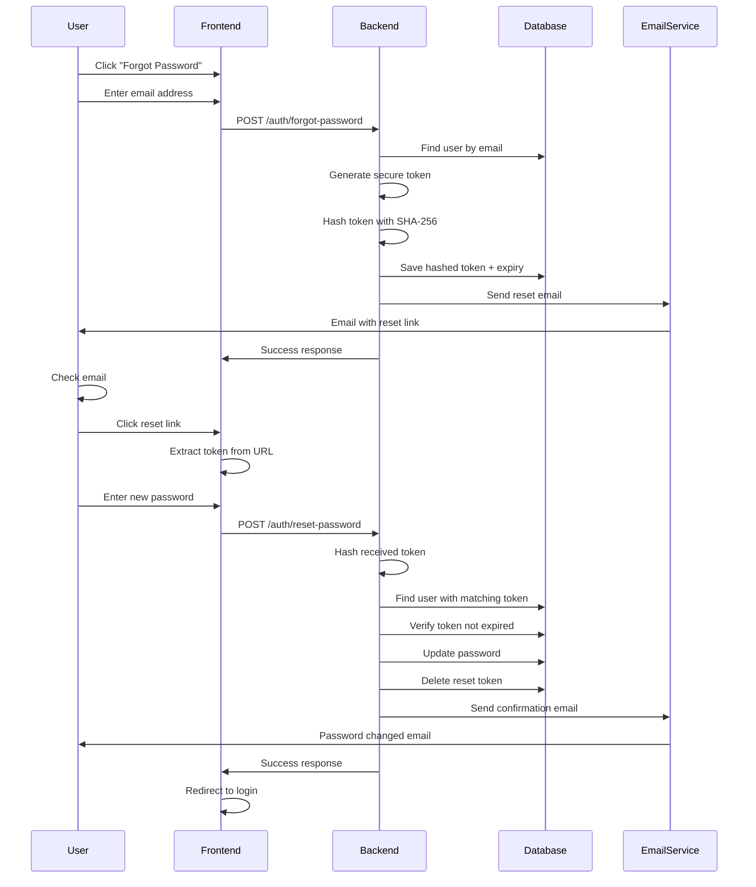

# Password Reset System Implementation

## Overview

A complete, secure password reset system has been implemented for the Fuel Order Management System. This allows users to reset their passwords via email without administrator intervention.

## Features

### 🔐 Security Features
- **Cryptographically secure tokens** using Node.js crypto module (32 bytes, hashed with SHA-256)
- **Token expiration** - Reset tokens expire after 30 minutes
- **One-time use tokens** - Tokens are deleted after successful password reset
- **Email enumeration prevention** - Same response message whether email exists or not
- **Password hashing** - bcrypt with salt rounds for secure password storage
- **Audit logging** - All password reset attempts are logged for security monitoring

### 📧 Email Notifications
- **Professional HTML email templates** with responsive design
- **Password reset request email** with secure reset link
- **Password changed confirmation email** for security awareness
- **SMTP configuration** via environment variables

### 🎨 User Interface
- **Forgot Password page** - Clean, professional UI for requesting password reset
- **Reset Password page** - Secure form for setting new password
- **Real-time password validation** - Client-side validation with feedback
- **Success/error notifications** - Clear user feedback throughout the process
- **Dark mode support** - Consistent with the rest of the application

## System Architecture

### Backend Components

#### 1. Database Model (`User.ts`)
```typescript
resetPasswordToken?: string;      // Hashed token stored in DB
resetPasswordExpires?: Date;       // Token expiration timestamp
```

#### 2. Email Service (`emailService.ts`)
- `sendPasswordResetEmail()` - Sends reset link to user's email
- `sendPasswordChangedEmail()` - Confirmation email after successful reset

#### 3. Authentication Controller (`authController.ts`)
- `forgotPassword()` - Handles reset request, generates token, sends email
- `resetPassword()` - Validates token, updates password

#### 4. Routes (`authRoutes.ts`)
```
POST /api/auth/forgot-password  - Request password reset
POST /api/auth/reset-password   - Reset password with token
```

#### 5. Validation (`validation.ts`)
- Email validation for forgot password
- Token format validation (64 characters hex)
- Password strength validation (minimum 6 characters)

### Frontend Components

#### 1. ForgotPassword Page
- Email input form
- Success/error messaging
- Automatic redirect to login after submission

#### 2. ResetPassword Page
- Token and email validation from URL parameters
- New password input with confirmation
- Real-time password strength validation
- Automatic redirect to login after successful reset

#### 3. Updated Login Page
- "Forgot Password?" link added
- Seamless navigation to password reset flow

## How It Works

### Password Reset Flow



## Configuration

### Environment Variables

Add these to your `.env` file:

```env
# SMTP Email Configuration
SMTP_HOST=smtp.gmail.com
SMTP_PORT=587
SMTP_SECURE=false
SMTP_USER=your-email@gmail.com
SMTP_PASS=your-app-password

# Frontend URL (for reset links)
FRONTEND_URL=http://localhost:5173
```

### Gmail Setup (Recommended)
1. Enable 2-factor authentication on your Google account
2. Generate an App Password:
   - Go to Google Account → Security
   - Select "2-Step Verification"
   - At the bottom, select "App passwords"
   - Generate a password for "Mail"
3. Use the generated password in `SMTP_PASS`

## API Endpoints

### 1. Request Password Reset

**Endpoint:** `POST /api/auth/forgot-password`

**Request Body:**
```json
{
  "email": "user@example.com"
}
```

**Response:** (Same for both existing and non-existing emails for security)
```json
{
  "success": true,
  "message": "If an account with that email exists, a password reset link has been sent."
}
```

**Error Responses:**
- `400` - Email is required
- `500` - Failed to send email

---

### 2. Reset Password

**Endpoint:** `POST /api/auth/reset-password`

**Request Body:**
```json
{
  "email": "user@example.com",
  "token": "64-character-hex-token",
  "newPassword": "newSecurePassword123"
}
```

**Response:**
```json
{
  "success": true,
  "message": "Password has been reset successfully. You can now log in with your new password."
}
```

**Error Responses:**
- `400` - Missing required fields
- `400` - Password too short (< 6 characters)
- `400` - Invalid or expired token
- `500` - Server error

## Frontend Routes

- `/login` - Standard login page
- `/forgot-password` - Request password reset
- `/reset-password?token=xxx&email=xxx` - Reset password form

## Security Considerations

### ✅ Implemented Security Measures

1. **Token Security**
   - Random 32-byte tokens (64 hex characters)
   - SHA-256 hashing before storage
   - 30-minute expiration
   - One-time use only

2. **Email Enumeration Prevention**
   - Identical responses for existing/non-existing accounts
   - Prevents attackers from discovering valid email addresses

3. **Rate Limiting**
   - Backend rate limiting already in place
   - Prevents brute force attacks

4. **Audit Trail**
   - All password resets logged with timestamp and IP
   - Security team can monitor suspicious activity

5. **Session Invalidation**
   - All refresh tokens cleared on password reset
   - Forces re-authentication on all devices

6. **Email Verification**
   - Reset link sent only to registered email
   - Confirms user has access to email account

### 🔒 Best Practices

1. **HTTPS Only** - Use HTTPS in production
2. **Strong Passwords** - Enforce minimum 6 characters (consider increasing to 8+)
3. **Email Security** - Use app-specific passwords for Gmail
4. **Token Cleanup** - Tokens automatically expire and are deleted
5. **User Notification** - Users receive confirmation emails after password changes

## Testing

### Manual Testing Steps

1. **Request Password Reset**
   ```bash
   curl -X POST http://localhost:5000/api/auth/forgot-password \
     -H "Content-Type: application/json" \
     -d '{"email":"user@example.com"}'
   ```

2. **Check Email** - Verify reset email was received

3. **Reset Password** - Click link or use API:
   ```bash
   curl -X POST http://localhost:5000/api/auth/reset-password \
     -H "Content-Type: application/json" \
     -d '{
       "email":"user@example.com",
       "token":"token-from-email",
       "newPassword":"newPassword123"
     }'
   ```

4. **Login** - Test login with new password

### Test Scenarios

✅ **Happy Path**
- User requests reset → receives email → resets password → logs in

✅ **Error Scenarios**
- Non-existent email (shows same success message)
- Expired token (30+ minutes old)
- Invalid token format
- Mismatched passwords
- Password too short
- Token reuse (already used)

## Troubleshooting

### Email Not Sending

**Check:**
1. SMTP credentials in `.env` are correct
2. Gmail App Password is enabled (not regular password)
3. Check backend logs for email errors
4. Verify email service initialized: `Email service initialized successfully`

**Debug:**
```bash
# Check backend logs
tail -f backend/logs/app.log

# Test SMTP connection manually
node -e "
const nodemailer = require('nodemailer');
const transport = nodemailer.createTransport({
  host: 'smtp.gmail.com',
  port: 587,
  auth: { user: 'your@email.com', pass: 'your-app-password' }
});
transport.verify().then(console.log).catch(console.error);
"
```

### Token Validation Failed

**Common Issues:**
- Token expired (> 30 minutes)
- Token already used
- Token format incorrect
- Email doesn't match

**Solution:**
- Request new reset link
- Ensure token is copied correctly from email

### Email Goes to Spam

**Solutions:**
1. Add sender email to contacts
2. Use a verified domain email
3. Configure SPF/DKIM records (production)
4. Check email content for spam triggers

## Future Enhancements

### Potential Improvements

1. **Password Strength Meter**
   - Visual indicator of password strength
   - Requirements checklist

2. **Multi-Factor Authentication**
   - SMS or authenticator app verification
   - Additional security layer

3. **Password History**
   - Prevent reuse of last N passwords
   - Enforce periodic password changes

4. **Account Recovery Questions**
   - Alternative recovery method
   - Security questions backup

5. **IP-based Security**
   - Notify on login from new location
   - Suspicious activity detection

6. **Customizable Token Expiry**
   - Admin-configurable expiration time
   - Different expiry for different user roles

## Code Examples

### Requesting Password Reset (Frontend)

```typescript
import { authAPI } from '../services/api';

const handleForgotPassword = async (email: string) => {
  try {
    await authAPI.forgotPassword(email);
    // Show success message
    alert('Reset link sent to your email');
  } catch (error) {
    console.error('Failed to send reset email:', error);
  }
};
```

### Resetting Password (Frontend)

```typescript
import { authAPI } from '../services/api';

const handleResetPassword = async (email: string, token: string, newPassword: string) => {
  try {
    await authAPI.resetPassword({ email, token, newPassword });
    // Redirect to login
    navigate('/login');
  } catch (error) {
    console.error('Failed to reset password:', error);
  }
};
```

## Monitoring & Analytics

### Audit Logs

All password reset activities are logged in the audit system:

```typescript
// View password reset logs
AuditService.getLogs({
  action: 'PASSWORD_RESET',
  startDate: new Date('2024-01-01'),
  endDate: new Date(),
  limit: 50
});
```

### Metrics to Monitor

- Number of password reset requests per day
- Success rate of password resets
- Time between request and reset
- Failed reset attempts
- Common error patterns

## Support

### Common User Questions

**Q: How long is the reset link valid?**
A: Reset links expire after 30 minutes for security.

**Q: Can I use the same link twice?**
A: No, reset links are single-use only.

**Q: I didn't receive the email. What should I do?**
A: Check your spam folder. If still not there, request a new reset link.

**Q: Can I reset my password without email access?**
A: No, email verification is required for security. Contact your system administrator if you've lost email access.

## Deployment Checklist

- [ ] Configure production SMTP credentials
- [ ] Set production FRONTEND_URL in `.env`
- [ ] Enable HTTPS for all endpoints
- [ ] Test email delivery in production
- [ ] Configure proper SPF/DKIM records
- [ ] Set up email monitoring/alerts
- [ ] Test rate limiting settings
- [ ] Review audit logs regularly
- [ ] Document password policy for users
- [ ] Train support staff on password reset process

---

**Implementation Date:** December 12, 2025  
**Version:** 1.0.0  
**Status:** ✅ Complete and Ready for Production
