# FUEL ORDER MANAGEMENT SYSTEM (FOMS)
## Use Case Diagram — Full System

> **Code-Verified** — All actors, roles, and use cases are derived directly from the backend controllers, routes, models, and middleware in `/backend/src/`.

---

## Diagram Legend

| Symbol | Meaning |
|---|---|
| Blue nodes | **Actor** (person or external system) — placed *outside* system boundary |
| Green nodes | **Core Use Case** — primary system function |
| Yellow nodes | **Sub-function Use Case** — always called via `<<include>>` |
| Pink/Red nodes | **Extension Use Case** — optional, called via `<<extend>>` |
| Grey dashed nodes | **External System Actor** |
| `----` solid line | **Association** — actor participates in use case |
| `- - ->>` dashed arrow | **<<include>>** — base → included (MANDATORY, always executes) |
| `- - ->>` dashed arrow | **<<extend>>** — extension → base (OPTIONAL, conditional) |
| `──────▷` hollow arrow | **Generalization** — inheritance between actors |

---

## Main Use Case Diagram

```mermaid
flowchart TB
    %%──────────────────────────────────────────
    %% ACTORS  (all sit OUTSIDE the system box)
    %%──────────────────────────────────────────

    FOM(["👤 Fuel Order Maker"])
    MGR(["👤 Manager / Boss"])
    ATT(["👤 Fuel Attendant\n+ Station Manager"])
    YRD(["👤 Yard Personnel"])
    DRV(["👤 Driver"])
    ADM(["👤 Admin"])
    SAM(["👤 Super Admin"])

    NGW(["⚙️ Notification Gateway\n(Email / SMS / Push)"])

    %%──────────────────────────────────────────
    %% SYSTEM BOUNDARY
    %%──────────────────────────────────────────
    subgraph SYSTEM["╔══════════════════════════════════════════════════╗  FUEL ORDER MANAGEMENT SYSTEM  ╚══════════════════════════════════════════════════╝"]

        %%─────────────────────────────────────
        %% ZONE A — AUTHENTICATION & SESSION
        %%─────────────────────────────────────
        subgraph ZA["  Zone A — Authentication & Session  "]
            direction TB
            UC_A1(["UC-A1\nLogin to System"])
            UC_A2(["UC-A2\nLogout from System"])
            UC_A3(["UC-A3\nAuthenticate User\n〔sub-function〕"])
            UC_A4(["UC-A4\nManage MFA\n(Enable / Verify / Disable)"])
            UC_A5(["UC-A5\nReset Password\n(Forgot Password Flow)"])
            UC_A6(["UC-A6\nChange Password"])
            UC_A7(["UC-A7\nForce Password Change\n(First Login / Admin Reset)"])
        end

        %%─────────────────────────────────────
        %% ZONE B — DELIVERY ORDER MANAGEMENT
        %%─────────────────────────────────────
        subgraph ZB["  Zone B — Delivery Order (DO) Management  "]
            direction TB
            UC_B1(["UC-B1\nCreate Delivery Order"])
            UC_B2(["UC-B2\nView / Search Delivery Orders"])
            UC_B3(["UC-B3\nTrack Truck Journey"])
            UC_B4(["UC-B4\nExport DO Workbook\n(Excel)"])
            UC_B5(["UC-B5\nDownload DO PDF"])
            UC_B6(["UC-B6\nCreate / Manage SDO\n(Supplementary Delivery Order)"])
        end

        %%─────────────────────────────────────
        %% ZONE C — LPO MANAGEMENT
        %%─────────────────────────────────────
        subgraph ZC["  Zone C — LPO Management  "]
            direction TB
            UC_C1(["UC-C1\nCreate LPO Entry\n(Fuel Station Order)"])
            UC_C2(["UC-C2\nUpdate LPO Entry"])
            UC_C3(["UC-C3\nCreate LPO Summary\n/ Allocate Trucks"])
            UC_C4(["UC-C4\nForward LPO\nto Another Station"])
            UC_C5(["UC-C5\nCancel Truck\nin LPO"])
            UC_C6(["UC-C6\nApprove LPO Payment"])
            UC_C7(["UC-C7\nExport LPO Workbook\n(Excel)"])
        end

        %%─────────────────────────────────────
        %% ZONE D — FUEL RECORDS & DISPENSING
        %%─────────────────────────────────────
        subgraph ZD["  Zone D — Fuel Records & Dispensing  "]
            direction TB
            UC_D1(["UC-D1\nRecord Station\nFuel Dispensing"])
            UC_D2(["UC-D2\nView Fuel Records"])
            UC_D3(["UC-D3\nGenerate Monthly\nFuel Summary"])
            UC_D4(["UC-D4\nDispense Yard Fuel"])
            UC_D5(["UC-D5\nReject Yard Fuel\nRequest"])
            UC_D6(["UC-D6\nView Yard Fuel\nHistory / Rejections"])
        end

        %%─────────────────────────────────────
        %% ZONE E — FLEET TRACKING & CHECKPOINTS
        %%─────────────────────────────────────
        subgraph ZE["  Zone E — Fleet Tracking & Checkpoints  "]
            direction TB
            UC_E1(["UC-E1\nUpload Fleet\nPosition Report"])
            UC_E2(["UC-E2\nView Truck Positions\n& Checkpoint Status"])
            UC_E3(["UC-E3\nView Checkpoint\nDistribution Stats"])
            UC_E4(["UC-E4\nManage Checkpoints\n(Create / Edit / Reorder)"])
        end

        %%─────────────────────────────────────
        %% ZONE F — USER & ACCESS MANAGEMENT
        %%─────────────────────────────────────
        subgraph ZF["  Zone F — User & Access Management  "]
            direction TB
            UC_F1(["UC-F1\nCreate User Account"])
            UC_F2(["UC-F2\nUpdate User Account"])
            UC_F3(["UC-F3\nDelete / Deactivate\nUser"])
            UC_F4(["UC-F4\nAssign Roles\n& Permissions"])
            UC_F5(["UC-F5\nBulk User Operations\n(Delete / Reset Passwords)"])
            UC_F6(["UC-F6\nImport / Export\nUser Records"])
        end

        %%─────────────────────────────────────
        %% ZONE G — REPORTS & ANALYTICS
        %%─────────────────────────────────────
        subgraph ZG["  Zone G — Reports & Analytics  "]
            direction TB
            UC_G1(["UC-G1\nView Dashboard\n(Stats & Charts)"])
            UC_G2(["UC-G2\nGenerate Analytics\nReport"])
            UC_G3(["UC-G3\nExport Analytics\nReport"])
            UC_G4(["UC-G4\nView Audit Log"])
            UC_G5(["UC-G5\nGenerate Custom\nReport"])
        end

        %%─────────────────────────────────────
        %% ZONE H — SYSTEM ADMINISTRATION
        %%─────────────────────────────────────
        subgraph ZH["  Zone H — System Administration  "]
            direction TB
            UC_H1(["UC-H1\nManage Fuel Stations\n(Add / Update Rates)"])
            UC_H2(["UC-H2\nManage Route\nConfiguration"])
            UC_H3(["UC-H3\nConfigure System\nSettings"])
            UC_H4(["UC-H4\nManage System\nBackup & Schedule"])
            UC_H5(["UC-H5\nArchive / Restore\nData"])
            UC_H6(["UC-H6\nManage Driver\nAccount Entries"])
            UC_H7(["UC-H7\nManage Driver\nCredentials"])
            UC_H8(["UC-H8\nToggle Maintenance\nMode"])
            UC_H9(["UC-H9\nManage Fuel\nPrices"])
        end

        %%─────────────────────────────────────
        %% ZONE I — NOTIFICATIONS
        %%─────────────────────────────────────
        subgraph ZI["  Zone I — Notifications  "]
            direction TB
            UC_I1(["UC-I1\nView Notifications"])
            UC_I2(["UC-I2\nSend Notification\n〔sub-function〕"])
            UC_I3(["UC-I3\nSubscribe to\nPush Notifications"])
            UC_I4(["UC-I4\nConfigure Notification\nSettings"])
        end

        %%─────────────────────────────────────
        %% ZONE J — SECURITY MANAGEMENT
        %%─────────────────────────────────────
        subgraph ZJ["  Zone J — Security Management  "]
            direction TB
            UC_J1(["UC-J1\nManage IP Rules\n/ Blocklist"])
            UC_J2(["UC-J2\nMonitor Security\nEvents & Alerts"])
            UC_J3(["UC-J3\nConfigure Firewall\nRules"])
            UC_J4(["UC-J4\nView Security\nAudit Log"])
            UC_J5(["UC-J5\nManage Threat\nDetection Rules"])
        end

    end

    %%──────────────────────────────────────────────────────────────
    %% ACTOR ASSOCIATIONS  (solid lines — no arrowhead)
    %%──────────────────────────────────────────────────────────────

    %% ── Fuel Order Maker ────────────────────────────────────────
    FOM --- UC_A1
    FOM --- UC_A6
    FOM --- UC_B1
    FOM --- UC_B2
    FOM --- UC_B3
    FOM --- UC_C3
    FOM --- UC_E1
    FOM --- UC_E2
    FOM --- UC_E4
    FOM --- UC_I1


    %% ── Manager / Boss ──────────────────────────────────────────
    MGR --- UC_A1
    MGR --- UC_A6
    MGR --- UC_B2
    MGR --- UC_C6
    MGR --- UC_D3
    MGR --- UC_G1
    MGR --- UC_G2
    MGR --- UC_I1

    %% ── Fuel Attendant / Station Manager ────────────────────────
    ATT --- UC_A1
    ATT --- UC_A6
    ATT --- UC_C2
    ATT --- UC_C4
    ATT --- UC_C5
    ATT --- UC_D1
    ATT --- UC_D2

    %% ── Yard Personnel ──────────────────────────────────────────
    YRD --- UC_A1
    YRD --- UC_A6
    YRD --- UC_D4
    YRD --- UC_D6
    YRD --- UC_I1

    %% ── Driver ──────────────────────────────────────────────────
    DRV --- UC_A1
    DRV --- UC_A6
    DRV --- UC_D2

    %% ── Admin ───────────────────────────────────────────────────
    ADM --- UC_A1
    ADM --- UC_A6
    ADM --- UC_F1
    ADM --- UC_F2
    ADM --- UC_F3
    ADM --- UC_F4
    ADM --- UC_G4
    ADM --- UC_H1
    ADM --- UC_H2
    ADM --- UC_H3
    ADM --- UC_H6
    ADM --- UC_H7
    ADM --- UC_H8
    ADM --- UC_H9

    %% ── Super Admin ─────────────────────────────────────────────
    SAM --- UC_A1
    SAM --- UC_G2
    SAM --- UC_G3
    SAM --- UC_G4
    SAM --- UC_H4
    SAM --- UC_H5
    SAM --- UC_J1
    SAM --- UC_J2
    SAM --- UC_J3
    SAM --- UC_J4
    SAM --- UC_J5

    %% ── External: Notification Gateway ──────────────────────────
    NGW --- UC_I2

    %%──────────────────────────────────────────────────────────────
    %% <<include>> RELATIONSHIPS
    %% Rule: Arrow points FROM base use case TO the included sub-function
    %% Meaning: The included use case ALWAYS executes when the base runs
    %%──────────────────────────────────────────────────────────────

    UC_A1   -. "<<include>>" .-> UC_A3
    UC_B1   -. "<<include>>" .-> UC_A3
    UC_C1   -. "<<include>>" .-> UC_A3
    UC_C3   -. "<<include>>" .-> UC_A3
    UC_D1   -. "<<include>>" .-> UC_A3
    UC_D4   -. "<<include>>" .-> UC_A3
    UC_F1   -. "<<include>>" .-> UC_A3
    UC_G2   -. "<<include>>" .-> UC_A3

    UC_D1   -. "<<include>>" .-> UC_C1
    UC_B3   -. "<<include>>" .-> UC_B2
    UC_C6   -. "<<include>>" .-> UC_I2
    UC_B1   -. "<<include>>" .-> UC_I2
    UC_D5   -. "<<include>>" .-> UC_I2
    UC_F1   -. "<<include>>" .-> UC_I2

    %%──────────────────────────────────────────────────────────────
    %% <<extend>> RELATIONSHIPS
    %% Rule: Arrow points FROM the extending use case TO the base use case
    %% Meaning: The extension runs ONLY when a condition is met
    %%──────────────────────────────────────────────────────────────

    UC_A4   -. "<<extend>>" .-> UC_A1
    UC_A5   -. "<<extend>>" .-> UC_A1
    UC_A7   -. "<<extend>>" .-> UC_A1

    UC_B4   -. "<<extend>>" .-> UC_B2
    UC_B5   -. "<<extend>>" .-> UC_B2
    UC_B6   -. "<<extend>>" .-> UC_B1

    UC_C4   -. "<<extend>>" .-> UC_C3
    UC_C5   -. "<<extend>>" .-> UC_C3
    UC_C7   -. "<<extend>>" .-> UC_C3

    UC_D5   -. "<<extend>>" .-> UC_D4
    UC_D6   -. "<<extend>>" .-> UC_D4

    UC_E1   -. "<<extend>>" .-> UC_E2

    UC_G3   -. "<<extend>>" .-> UC_G2
    UC_G5   -. "<<extend>>" .-> UC_G2

    UC_F5   -. "<<extend>>" .-> UC_F3
    UC_F6   -. "<<extend>>" .-> UC_F1

    %%──────────────────────────────────────────────────────────────
    %% GENERALIZATION  (Actor Inheritance)
    %% Solid line — Super Admin generalizes Admin
    %%──────────────────────────────────────────────────────────────
    SAM -->|"generalizes ▷"| ADM

    %%──────────────────────────────────────────────────────────────
    %% STYLING
    %%──────────────────────────────────────────────────────────────
    classDef actor       fill:#dbeafe,stroke:#1d4ed8,stroke-width:2px,color:#1e3a5f,font-weight:bold
    classDef external    fill:#f1f5f9,stroke:#64748b,stroke-width:2px,color:#334155,stroke-dasharray:5 5
    classDef coreUC      fill:#dcfce7,stroke:#15803d,stroke-width:1.5px,color:#14532d
    classDef subFunc     fill:#fef9c3,stroke:#b45309,stroke-width:2px,color:#713f12,font-weight:bold
    classDef extension   fill:#fce7f3,stroke:#be185d,stroke-width:1.5px,color:#831843

    class FOM,MGR,ATT,YRD,DRV,ADM,SAM actor
    class NGW external

    class UC_A3,UC_I2 subFunc

    class UC_A4,UC_A5,UC_A7,UC_B4,UC_B5,UC_B6,UC_C4,UC_C5,UC_C7,UC_D5,UC_D6,UC_E1,UC_G3,UC_G5,UC_F5,UC_F6 extension

    class UC_A1,UC_A2,UC_A6,UC_B1,UC_B2,UC_B3,UC_C1,UC_C2,UC_C3,UC_C6,UC_D1,UC_D2,UC_D3,UC_D4,UC_E2,UC_E3,UC_E4,UC_F1,UC_F2,UC_F3,UC_F4,UC_G1,UC_G2,UC_G4,UC_H1,UC_H2,UC_H3,UC_H4,UC_H5,UC_H6,UC_H7,UC_H8,UC_H9,UC_I1,UC_I3,UC_I4,UC_J1,UC_J2,UC_J3,UC_J4,UC_J5 coreUC
```

---

## Actor Catalog

| Actor | Code Role(s) | Type | Description |
|---|---|---|---|
| **Fuel Order Maker** | `fuel_order_maker` | Primary | Creates Delivery Orders (DOs), LPO Summaries, manages checkpoints & fleet reports |
| **Manager / Boss** | `manager`, `super_manager`, `boss` | Primary | Approves LPO payments, views reports, oversees operations |
| **Fuel Attendant / Station Manager** | `fuel_attendant`, `station_manager` | Primary | Updates LPO entries at fuel station, forwards/cancels LPOs, records fuel |
| **Yard Personnel** | `yard_personnel`, `dar_yard`, `tanga_yard`, `mmsa_yard` | Primary | Dispenses fuel at internal company yards |
| **Driver** | `driver` | Primary | Receives fuel, tracked through journey/checkpoint system |
| **Admin** | `admin` | Primary | Manages users, fuel stations, routes, driver records, system config |
| **Super Admin** | `super_admin` | Primary | Full system access including analytics, security, backup, archival |
| **Notification Gateway** | — | Secondary (External) | Email, SMS, and push notification delivery system |

---

## Use Case Inventory

### Zone A — Authentication & Session
| ID | Use Case | Actor(s) | Notes |
|---|---|---|---|
| UC-A1 | Login to System | All actors | Triggers `<<include>>` UC-A3 (Authenticate User) |
| UC-A2 | Logout from System | All actors | Invalidates session/token |
| UC-A3 | **Authenticate User** *(sub-function)* | System | Called via `<<include>>` by every protected use case; validates JWT + role |
| UC-A4 | Manage MFA | All actors | `<<extend>>` UC-A1 — condition: MFA is enabled for the user |
| UC-A5 | Reset Password (Forgot Password) | All actors | `<<extend>>` UC-A1 — condition: user requests password recovery |
| UC-A6 | Change Password | All actors | Normal post-login action |
| UC-A7 | Force Password Change | All actors | `<<extend>>` UC-A1 — condition: first login flag or admin-triggered reset |

### Zone B — Delivery Order (DO) Management
| ID | Use Case | Actor(s) | Notes |
|---|---|---|---|
| UC-B1 | Create Delivery Order | Fuel Order Maker | `<<include>>` UC-A3, UC-I2 (notify on creation) |
| UC-B2 | View / Search Delivery Orders | Fuel Order Maker, Manager, Attendant | Base for export/PDF extensions |
| UC-B3 | Track Truck Journey | Fuel Order Maker | `<<include>>` UC-B2 — journey data tied to DOs |
| UC-B4 | Export DO Workbook (Excel) | Authorized roles | `<<extend>>` UC-B2 — condition: export requested |
| UC-B5 | Download DO PDF | Authorized roles | `<<extend>>` UC-B2 — condition: PDF download requested |
| UC-B6 | Create / Manage SDO (Supplementary DO) | Fuel Order Maker | `<<extend>>` UC-B1 — condition: the journey requires a supplement |

### Zone C — LPO Management
| ID | Use Case | Actor(s) | Notes |
|---|---|---|---|
| UC-C1 | Create LPO Entry | Fuel Order Maker, Boss | `<<include>>` UC-A3; also included by UC-D1 |
| UC-C2 | Update LPO Entry | Attendant, Station Manager | Updates status, quantities, or payment info |
| UC-C3 | Create LPO Summary / Allocate Trucks | Fuel Order Maker, Boss | `<<include>>` UC-A3; base for Forward/Cancel/Export |
| UC-C4 | Forward LPO to Another Station | Attendant, Station Manager | `<<extend>>` UC-C3 — condition: truck/fuel redirected |
| UC-C5 | Cancel Truck in LPO | Attendant, Station Manager | `<<extend>>` UC-C3 — condition: truck removed from allocation |
| UC-C6 | Approve LPO Payment | Manager | `<<include>>` UC-I2 (notify stakeholders on approval) |
| UC-C7 | Export LPO Workbook (Excel) | Authorized roles | `<<extend>>` UC-C3 — condition: export requested |

### Zone D — Fuel Records & Dispensing
| ID | Use Case | Actor(s) | Notes |
|---|---|---|---|
| UC-D1 | Record Station Fuel Dispensing | Attendant, Yard personnel (station) | `<<include>>` UC-A3 + UC-C1 (validates against LPO entry) |
| UC-D2 | View Fuel Records | Attendant, Manager, Driver | Read access across roles |
| UC-D3 | Generate Monthly Fuel Summary | Manager, Boss | Aggregated report per truck/route |
| UC-D4 | Dispense Yard Fuel | Yard Personnel | `<<include>>` UC-A3; base for reject/history |
| UC-D5 | Reject Yard Fuel Request | Fuel Order Maker, Admin, Manager | `<<extend>>` UC-D4 — condition: invalid or unauthorized dispense |
| UC-D6 | View Yard Fuel History / Rejections | Yard Personnel | `<<extend>>` UC-D4 — condition: viewing past rejection records |

### Zone E — Fleet Tracking & Checkpoints
| ID | Use Case | Actor(s) | Notes |
|---|---|---|---|
| UC-E1 | Upload Fleet Position Report | Fuel Order Maker, Admin | `<<extend>>` UC-E2 — condition: new fleet snapshot uploaded |
| UC-E2 | View Truck Positions & Checkpoint Status | All authenticated | Central live-tracking view |
| UC-E3 | View Checkpoint Distribution Stats | All authenticated | Aggregated count per checkpoint |
| UC-E4 | Manage Checkpoints | Fuel Order Maker, Admin | Create, edit, reorder checkpoints |

### Zone F — User & Access Management
| ID | Use Case | Actor(s) | Notes |
|---|---|---|---|
| UC-F1 | Create User Account | Admin, Super Admin | `<<include>>` UC-A3 + UC-I2 (welcome notification) |
| UC-F2 | Update User Account | Admin, Super Admin | Update profile, role, or status |
| UC-F3 | Delete / Deactivate User | Admin, Super Admin | Permanent removal or soft disable |
| UC-F4 | Assign Roles & Permissions | Admin, Super Admin | Part of create/update flow |
| UC-F5 | Bulk User Operations | Admin, Super Admin | `<<extend>>` UC-F3 — condition: batch operation requested |
| UC-F6 | Import / Export User Records | Admin, Super Admin | `<<extend>>` UC-F1 — condition: CSV import triggered |

### Zone G — Reports & Analytics
| ID | Use Case | Actor(s) | Notes |
|---|---|---|---|
| UC-G1 | View Dashboard (Stats & Charts) | Manager, Boss, All | Real-time stats: DOs, fuel, journeys |
| UC-G2 | Generate Analytics Report | Super Admin, Manager | `<<include>>` UC-A3; detailed system analytics |
| UC-G3 | Export Analytics Report | Super Admin | `<<extend>>` UC-G2 — condition: export requested |
| UC-G4 | View Audit Log | Admin, Super Admin | Full system and user action history |
| UC-G5 | Generate Custom Report | Super Admin | `<<extend>>` UC-G2 — condition: custom report configured |

### Zone H — System Administration
| ID | Use Case | Actor(s) | Notes |
|---|---|---|---|
| UC-H1 | Manage Fuel Stations | Admin, Super Admin | Add stations, update rates |
| UC-H2 | Manage Route Configuration | Admin, Super Admin | Define routes and fuel allocations per route |
| UC-H3 | Configure System Settings | Admin, Super Admin | System-wide configs (maintenance, thresholds) |
| UC-H4 | Manage System Backup & Schedule | Super Admin | On-demand and scheduled backups |
| UC-H5 | Archive / Restore Data | Super Admin | Archived records management |
| UC-H6 | Manage Driver Account Entries | Admin, Fuel Order Maker | Driver ledger / account workbook |
| UC-H7 | Manage Driver Credentials | Admin | Driver login credentials and access |
| UC-H8 | Toggle Maintenance Mode | Admin, Super Admin | Enable/disable system maintenance window |
| UC-H9 | Manage Fuel Prices | Admin, Super Admin | Update per-liter pricing by station |

### Zone I — Notifications
| ID | Use Case | Actor(s) | Notes |
|---|---|---|---|
| UC-I1 | View Notifications | All actors | Inbox of system notifications per user |
| UC-I2 | **Send Notification** *(sub-function)* | System / Notification Gateway | Called via `<<include>>` when orders, payments, rejections occur |
| UC-I3 | Subscribe to Push Notifications | All actors | Browser and mobile push subscription |
| UC-I4 | Configure Notification Settings | Admin, Super Admin | Manage notification templates and channels |

### Zone J — Security Management *(Super Admin only)*
| ID | Use Case | Actor(s) | Notes |
|---|---|---|---|
| UC-J1 | Manage IP Rules / Blocklist | Super Admin | Block/allow IPs and CIDR ranges |
| UC-J2 | Monitor Security Events & Alerts | Super Admin | Real-time security event feed |
| UC-J3 | Configure Firewall Rules | Super Admin | Path-level firewall and egress filter rules |
| UC-J4 | View Security Audit Log | Super Admin | Detailed security action log |
| UC-J5 | Manage Threat Detection Rules | Super Admin | Anomaly detection, session analysis |

---

## Relationship Map

### `<<include>>` Relationships
> Arrow direction: **Base Use Case ─────────────→ Included Use Case**
> The included use case **always** executes when the base runs (mandatory).

| Base Use Case | → | Included Sub-Function | Reason |
|---|---|---|---|
| UC-A1 Login | → | UC-A3 Authenticate User | Every login validates credentials |
| UC-B1 Create Delivery Order | → | UC-A3 Authenticate User | Protected route; auth middleware always runs |
| UC-C1 Create LPO Entry | → | UC-A3 Authenticate User | Protected route |
| UC-C3 Create LPO Summary | → | UC-A3 Authenticate User | Protected route |
| UC-D1 Record Fuel Dispensing | → | UC-A3 Authenticate User | Protected route |
| UC-D4 Dispense Yard Fuel | → | UC-A3 Authenticate User | Protected route |
| UC-F1 Create User Account | → | UC-A3 Authenticate User | Admin-only protected route |
| UC-G2 Generate Analytics Report | → | UC-A3 Authenticate User | Super Admin route |
| UC-D1 Record Fuel Dispensing | → | UC-C1 Validate LPO Entry | Fuel record references & validates its LPO entry |
| UC-B3 Track Truck Journey | → | UC-B2 View Delivery Orders | Journey view always fetches the associated DOs |
| UC-C6 Approve LPO Payment | → | UC-I2 Send Notification | Approval always triggers stakeholder notification |
| UC-B1 Create Delivery Order | → | UC-I2 Send Notification | New DO always notifies relevant users |
| UC-D5 Reject Yard Fuel Request | → | UC-I2 Send Notification | Rejection always notifies yard personnel |
| UC-F1 Create User Account | → | UC-I2 Send Notification | New account always sends welcome/credential notification |

### `<<extend>>` Relationships
> Arrow direction: **Extension Use Case ─────────────→ Base Use Case**
> The extension runs **only when a condition is met** (optional).

| Extension Use Case | → | Base Use Case | Condition |
|---|---|---|---|
| UC-A4 Manage MFA | → | UC-A1 Login | MFA is enabled for the user account |
| UC-A5 Reset Password | → | UC-A1 Login | User initiates "Forgot Password" flow |
| UC-A7 Force Password Change | → | UC-A1 Login | First login flag is set OR admin triggered a reset |
| UC-B4 Export DO Workbook | → | UC-B2 View Delivery Orders | User requests Excel workbook export |
| UC-B5 Download DO PDF | → | UC-B2 View Delivery Orders | User requests PDF download of a specific DO |
| UC-B6 Create / Manage SDO | → | UC-B1 Create Delivery Order | Journey requires a supplementary delivery order |
| UC-C4 Forward LPO to Another Station | → | UC-C3 Create LPO Summary | Fuel/truck is redirected to a different station |
| UC-C5 Cancel Truck in LPO | → | UC-C3 Create LPO Summary | A truck is removed from the allocation |
| UC-C7 Export LPO Workbook | → | UC-C3 Create LPO Summary | User requests Excel workbook export |
| UC-D5 Reject Yard Fuel Request | → | UC-D4 Dispense Yard Fuel | Dispense is invalid or unauthorized |
| UC-D6 View Yard Fuel History | → | UC-D4 Dispense Yard Fuel | User views history of past yard transactions |
| UC-E1 Upload Fleet Position Report | → | UC-E2 View Truck Positions | New fleet snapshot file is uploaded |
| UC-G3 Export Analytics Report | → | UC-G2 Generate Analytics Report | User requests export of the generated report |
| UC-G5 Generate Custom Report | → | UC-G2 Generate Analytics Report | Custom report parameters are configured |
| UC-F5 Bulk User Operations | → | UC-F3 Delete / Deactivate User | Batch operation mode is selected |
| UC-F6 Import / Export User Records | → | UC-F1 Create User Account | CSV import triggers bulk account creation |

### Generalization (Actor Inheritance)
| Specialized Actor | ───▷ | General Actor | Meaning |
|---|---|---|---|
| Super Admin | ───▷ | Admin | Super Admin inherits all Admin capabilities and adds security, analytics, and backup access |

---

## Color Key Summary

| Color | Type | Example node |
|---|---|---|
| 🔵 Blue | **Actor** | Fuel Order Maker, Driver, Admin |
| 🟢 Green | **Core Use Case** | Create Delivery Order, View Dashboard |
| 🟡 Yellow | **Sub-function** (`<<include>>` target) | Authenticate User, Send Notification |
| 🔴 Pink/Red | **Extension** (`<<extend>>` source) | Manage MFA, Export Workbook, Reject Yard Fuel |
| ⬜ Grey dashed | **External Actor** | Notification Gateway |
