# FUEL ORDER MANAGEMENT SYSTEM (FOMS)
## Use Case Diagram — Simplified

---

## Diagram

```mermaid
flowchart TB
    %% ACTORS
    FOM(["👤 Fuel Order Maker"])
    MGR(["👤 Manager"])
    ATT(["👤 Fuel Attendant"])
    YRD(["👤 Yard Personnel"])
    DRV(["👤 Driver"])
    ADM(["👤 Admin"])
    SAM(["👤 Super Admin"])

    subgraph SYSTEM["FUEL ORDER MANAGEMENT SYSTEM"]
        UC1(["Login / Logout"])
        UC2(["Create Delivery Order"])
        UC3(["View Delivery Orders"])
        UC4(["Track Truck Journey"])
        UC5(["Create LPO Entry"])
        UC6(["Update LPO Entry"])
        UC7(["Approve LPO Payment"])
        UC8(["Record Fuel Dispensing"])
        UC9(["Dispense Yard Fuel"])
        UC10(["View Fuel Records"])
        UC11(["View Dashboard & Reports"])
        UC12(["Manage Users"])
        UC13(["Manage Fuel Stations & Routes"])
        UC14(["View Audit Log"])
        UC15(["Manage System Settings"])
    end

    FOM --- UC1 & UC2 & UC3 & UC4 & UC5
    MGR --- UC1 & UC3 & UC7 & UC10 & UC11
    ATT --- UC1 & UC6 & UC8 & UC10
    YRD --- UC1 & UC9 & UC10
    DRV --- UC1 & UC10
    ADM --- UC1 & UC12 & UC13 & UC14 & UC15
    SAM --- UC1 & UC11 & UC14 & UC15
    SAM -->|"inherits ▷"| ADM

    classDef actor fill:#ffffff,stroke:#000000,color:#000000,font-weight:bold
    classDef uc    fill:#ffffff,stroke:#000000,color:#000000
    class FOM,MGR,ATT,YRD,DRV,ADM,SAM actor
    class UC1,UC2,UC3,UC4,UC5,UC6,UC7,UC8,UC9,UC10,UC11,UC12,UC13,UC14,UC15 uc
```

---

## Actors

| Actor | Role |
|---|---|
| Fuel Order Maker | Creates delivery orders and LPO entries |
| Manager | Approves payments, views reports |
| Fuel Attendant | Updates LPO entries, records fuel at station |
| Yard Personnel | Dispenses fuel at internal yards |
| Driver | Views fuel records |
| Admin | Manages users, stations, routes, and settings |
| Super Admin | Full access — inherits all Admin capabilities |

---

## Use Cases

| # | Use Case | Actors |
|---|---|---|
| UC1 | Login / Logout | All |
| UC2 | Create Delivery Order | Fuel Order Maker |
| UC3 | View Delivery Orders | Fuel Order Maker, Manager, Attendant |
| UC4 | Track Truck Journey | Fuel Order Maker |
| UC5 | Create LPO Entry | Fuel Order Maker, Manager |
| UC6 | Update LPO Entry | Fuel Attendant |
| UC7 | Approve LPO Payment | Manager |
| UC8 | Record Fuel Dispensing | Fuel Attendant |
| UC9 | Dispense Yard Fuel | Yard Personnel |
| UC10 | View Fuel Records | Attendant, Manager, Yard Personnel, Driver |
| UC11 | View Dashboard & Reports | Manager, Super Admin |
| UC12 | Manage Users | Admin, Super Admin |
| UC13 | Manage Fuel Stations & Routes | Admin, Super Admin |
| UC14 | View Audit Log | Admin, Super Admin |
| UC15 | Manage System Settings | Admin, Super Admin |

